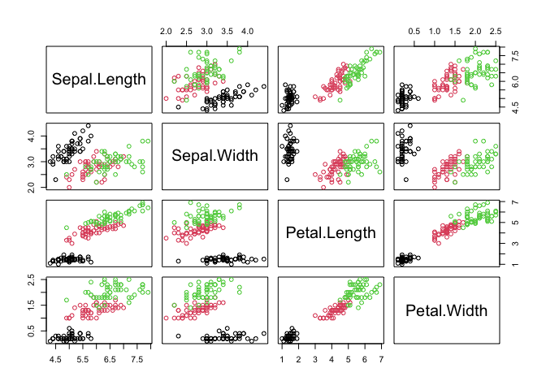

kNN Classification & Crossvalidation
================
2022-08-08

## Iris

``` r
# import iris data
iris.data <- read.csv("https://archive.ics.uci.edu/ml/machine-learning-databases/iris/bezdekIris.data", 
                      header = FALSE, 
                      col.names = c("Sepal.Length", "Sepal.Width", "Petal.Length", "Petal.Width", "Species"))

head(iris.data)
```

    ##   Sepal.Length Sepal.Width Petal.Length Petal.Width     Species
    ## 1          5.1         3.5          1.4         0.2 Iris-setosa
    ## 2          4.9         3.0          1.4         0.2 Iris-setosa
    ## 3          4.7         3.2          1.3         0.2 Iris-setosa
    ## 4          4.6         3.1          1.5         0.2 Iris-setosa
    ## 5          5.0         3.6          1.4         0.2 Iris-setosa
    ## 6          5.4         3.9          1.7         0.4 Iris-setosa

``` r
str(iris.data)
```

    ## 'data.frame':    150 obs. of  5 variables:
    ##  $ Sepal.Length: num  5.1 4.9 4.7 4.6 5 5.4 4.6 5 4.4 4.9 ...
    ##  $ Sepal.Width : num  3.5 3 3.2 3.1 3.6 3.9 3.4 3.4 2.9 3.1 ...
    ##  $ Petal.Length: num  1.4 1.4 1.3 1.5 1.4 1.7 1.4 1.5 1.4 1.5 ...
    ##  $ Petal.Width : num  0.2 0.2 0.2 0.2 0.2 0.4 0.3 0.2 0.2 0.1 ...
    ##  $ Species     : chr  "Iris-setosa" "Iris-setosa" "Iris-setosa" "Iris-setosa" ...

``` r
summary(iris.data)
```

    ##   Sepal.Length    Sepal.Width     Petal.Length    Petal.Width   
    ##  Min.   :4.300   Min.   :2.000   Min.   :1.000   Min.   :0.100  
    ##  1st Qu.:5.100   1st Qu.:2.800   1st Qu.:1.600   1st Qu.:0.300  
    ##  Median :5.800   Median :3.000   Median :4.350   Median :1.300  
    ##  Mean   :5.843   Mean   :3.057   Mean   :3.758   Mean   :1.199  
    ##  3rd Qu.:6.400   3rd Qu.:3.300   3rd Qu.:5.100   3rd Qu.:1.800  
    ##  Max.   :7.900   Max.   :4.400   Max.   :6.900   Max.   :2.500  
    ##    Species         
    ##  Length:150        
    ##  Class :character  
    ##  Mode  :character  
    ##                    
    ##                    
    ## 

``` r
pairs(~ ., data = iris.data[-5], 
      col = as.factor(iris.data$Species))
```

<!-- -->

## R Markdown

This is an R Markdown document. Markdown is a simple formatting syntax
for authoring HTML, PDF, and MS Word documents. For more details on
using R Markdown see <http://rmarkdown.rstudio.com>.

When you click the **Knit** button a document will be generated that
includes both content as well as the output of any embedded R code
chunks within the document. You can embed an R code chunk like this:

``` r
summary(cars)
```

    ##      speed           dist       
    ##  Min.   : 4.0   Min.   :  2.00  
    ##  1st Qu.:12.0   1st Qu.: 26.00  
    ##  Median :15.0   Median : 36.00  
    ##  Mean   :15.4   Mean   : 42.98  
    ##  3rd Qu.:19.0   3rd Qu.: 56.00  
    ##  Max.   :25.0   Max.   :120.00

## Including Plots

You can also embed plots, for example:

<!-- -->

Note that the `echo = FALSE` parameter was added to the code chunk to
prevent printing of the R code that generated the plot.
