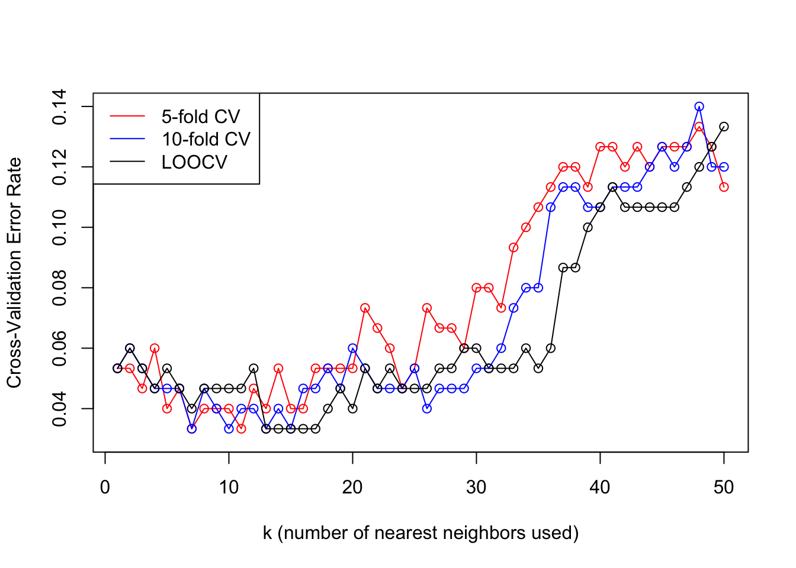

*K*-Nearest Neighbors (*k*NN) Classification & Cross-Validation
================
2022-08-08

## Iris

**PROBLEM STATEMENT**: for the *k*NN classifier, compare the 5-fold,
10-fold, and leave-one-out cross-validation error rates for *k* = 1, …,
50 on the classic `Iris` dataset

### Load the Data

Let’s download the data from the [UCI Machine Learning
Repository](https://archive.ics.uci.edu/ml/index.php)

``` r
# import iris data
iris.data <- read.csv(
  "https://archive.ics.uci.edu/ml/machine-learning-databases/iris/bezdekIris.data", 
  header = FALSE, 
  col.names = c("Sepal.Length", "Sepal.Width", "Petal.Length", "Petal.Width", "Species"))
```

### Look at the Data

``` r
head(iris.data)
```

    ##   Sepal.Length Sepal.Width Petal.Length Petal.Width     Species
    ## 1          5.1         3.5          1.4         0.2 Iris-setosa
    ## 2          4.9         3.0          1.4         0.2 Iris-setosa
    ## 3          4.7         3.2          1.3         0.2 Iris-setosa
    ## 4          4.6         3.1          1.5         0.2 Iris-setosa
    ## 5          5.0         3.6          1.4         0.2 Iris-setosa
    ## 6          5.4         3.9          1.7         0.4 Iris-setosa

``` r
# encode 5th column (Species) as categorical variable
iris.data[5] <- factor(iris.data[[5]])

str(iris.data)
```

    ## 'data.frame':    150 obs. of  5 variables:
    ##  $ Sepal.Length: num  5.1 4.9 4.7 4.6 5 5.4 4.6 5 4.4 4.9 ...
    ##  $ Sepal.Width : num  3.5 3 3.2 3.1 3.6 3.9 3.4 3.4 2.9 3.1 ...
    ##  $ Petal.Length: num  1.4 1.4 1.3 1.5 1.4 1.7 1.4 1.5 1.4 1.5 ...
    ##  $ Petal.Width : num  0.2 0.2 0.2 0.2 0.2 0.4 0.3 0.2 0.2 0.1 ...
    ##  $ Species     : Factor w/ 3 levels "Iris-setosa",..: 1 1 1 1 1 1 1 1 1 1 ...

``` r
summary(iris.data)
```

    ##   Sepal.Length    Sepal.Width     Petal.Length    Petal.Width   
    ##  Min.   :4.300   Min.   :2.000   Min.   :1.000   Min.   :0.100  
    ##  1st Qu.:5.100   1st Qu.:2.800   1st Qu.:1.600   1st Qu.:0.300  
    ##  Median :5.800   Median :3.000   Median :4.350   Median :1.300  
    ##  Mean   :5.843   Mean   :3.057   Mean   :3.758   Mean   :1.199  
    ##  3rd Qu.:6.400   3rd Qu.:3.300   3rd Qu.:5.100   3rd Qu.:1.800  
    ##  Max.   :7.900   Max.   :4.400   Max.   :6.900   Max.   :2.500  
    ##             Species  
    ##  Iris-setosa    :50  
    ##  Iris-versicolor:50  
    ##  Iris-virginica :50  
    ##                      
    ##                      
    ## 

`str` tells us

-   the dataset has 150 observations (rows) and 5 variables (columns)
-   four of the columns are numeric (continuous) variables
-   the `Species` column is categorical with 3 levels

`summary` tells us

-   the dataset has no missing values (NAs)
-   the observations are equally divided into the three `Species`
-   the variables are in different ranges and should therefore probably
    be scaled before *k*NN

``` r
# pairs plot of the data coloring by Species column
pairs(~ ., data = iris.data[-5], 
      col = factor(iris.data[[5]]), 
      oma = c(3, 3, 3, 14)) 

par(xpd = TRUE)
legend("bottomright", 
       fill = unique(iris$Species), 
       legend = c(levels(iris$Species)))
```


### Fit and Validate the *k*NN Model

Let’s use the `caret` package for model-fitting and for
cross-validation, testing 5-fold, 10-fold, and leave-one-out
cross-validation (CV)

``` r
# load caret package
library(caret)

# 5-fold, 10-fold, and leave-one-out (LOO) CV
numFolds <- c(5, 10, 150)

# list to store the different fits
fitList <- vector(mode = "list", length = length(numFolds))
names(fitList) <- numFolds

# loop through the three different CV types
for(i in 1:length(numFolds)){
  trControl <- trainControl(method = "cv",
                            number = numFolds[i])

# vary the number of nearest neighbors k from 1 to 50
set.seed(1250)
fitList[[i]] <- train(Species ~ .,
                        method = "knn",
                        tuneGrid = expand.grid(k = 1:50), 
                        preProcess = c("center", "scale"), 
                        trControl = trControl,
                        metric = "Accuracy",
                        data = iris.data)
}

# fitList
# str(fitList)
```

### Analyze Performance Metrics

Plot the results showing the comparison in performance

``` r
plot(1:50, 1-fitList[[1]]$results$Accuracy,
     type = "o", col = "red",
     xlab = "k (number of nearest neighbors used)", 
     ylab = "Cross-Validation Error Rate", 
     ylim = c(0.03, 0.14))

points(1:50, 1-fitList[[2]]$results$Accuracy, 
       type = "o", col = "blue")

points(1:50, 1-fitList[[3]]$results$Accuracy, 
       type = "o", col = "black")

legend("topleft", legend = c("5-fold CV", "10-fold CV", "LOOCV"),
       col = c("red", "blue", "black"), lty = 1)
```



## *k*NN classifer with different distance metrics: USPS digits

**PROBLEM STATEMENT**: for the *k*NN classifier, compare the test error
rates for three different distance metrics (Euclidean, Manhattan,
cosine) on the [USPS handwritten zip code digits
dataset](https://hastie.su.domains/ElemStatLearn/data.html)

### Load the data

``` r
library(tidyverse)
usps_train <- read_delim(
  "https://hastie.su.domains/ElemStatLearn/datasets/zip.train.gz", 
  delim = " ", col_names = FALSE, show_col_types = FALSE)
usps_test <- read_delim(
  "https://hastie.su.domains/ElemStatLearn/datasets/zip.test.gz", 
  delim = " ", col_names = FALSE, show_col_types = FALSE)
```

### Look at the data

[Each row
is](https://hastie.su.domains/ElemStatLearn/datasets/zip.info.txt) the
256 normalized grayscale values of the 16 x 16 pixel image of a digit.

The first column contains the identity (label) of the digit. The last
column of `usps_train` is all NA.

``` r
# str(usps_train)

usps_train <- as.matrix(usps_train)
usps_test <- as.matrix(usps_test)

# first column contains labels
usps_train_labels <- usps_train[, 1]
usps_test_labels <- usps_test[, 1]

# drop first column of usps_train and usps_test
usps_train <- usps_train[, -1]
usps_test <- usps_test[, -1]

# last column of usps_train is all NA
# summary(usps_train[, 257])

# drop last column (all NA) of usps_train
usps_train <- usps_train[, -257]

# head(usps_train)
# head(usps_test)

str(usps_train)
```

    ##  num [1:7291, 1:256] -1 -1 -1 -1 -1 -1 -1 -1 -1 -1 ...
    ##  - attr(*, "dimnames")=List of 2
    ##   ..$ : NULL
    ##   ..$ : chr [1:256] "X2" "X3" "X4" "X5" ...

``` r
str(usps_test)
```

    ##  num [1:2007, 1:256] -1 -1 -1 -1 -1 -1 -1 -1 -1 -1 ...
    ##  - attr(*, "dimnames")=List of 2
    ##   ..$ : NULL
    ##   ..$ : chr [1:256] "X2" "X3" "X4" "X5" ...

Encode labels as categorical variables (factors)

``` r
usps_train_labels <- factor(usps_train_labels)
usps_test_labels <- factor(usps_test_labels)

str(usps_train_labels)
```

    ##  Factor w/ 10 levels "0","1","2","3",..: 7 6 5 8 4 7 4 2 1 2 ...

``` r
str(usps_test_labels)
```

    ##  Factor w/ 10 levels "0","1","2","3",..: 10 7 4 7 7 1 1 1 7 10 ...

Define functions that calculate distance (Euclidean, Manhattan, cosine)
between two vectors.

These will be used to calculate the `n x m` distances between each of
the `n` test points and all the `m` train points.

``` r
euclidean_dist <- function(x1, x2){
  # calculates Euclidean distance between vectors x1 and x2
  return(sqrt(sum((x1 - x2) ^ 2)))
}
manhattan_dist <- function(x1, x2){
  # calculates Manhattan distance between vectors x1 and x2
  return(sum(abs(x1 - x2)))
}
cosine_dist <- function(x1, x2){
  # calculates Cosine distance between vectors x1 and x2
  # note, however, that the cosine distance is not a proper distance metric as it does not have the triangle inequality property
  # ?`%*%`
  return(1 - ((x1 %*% x2)/(sqrt(x1 %*% x1) * sqrt(x2 %*% x2))))
}
```

Calculate distance matrices

For the three ‘distances’ (Euclidean, Manhattan, cosine), we create a
matrix to store distances between each test point and all the train
points. Each row of the distance matrix is a test point, each column is
a train point, and the element (i, j) is the distance between test point
i and train point j. This matrix will be used to figure out each test
point’s nearest neighbors.

``` r
distances_Euclidean <- matrix(0, nrow = nrow(usps_test), ncol = nrow(usps_train))
distances_Manhattan <- matrix(0, nrow = nrow(usps_test), ncol = nrow(usps_train))
distances_Cosine <- matrix(0, nrow = nrow(usps_test), ncol = nrow(usps_train))
```

Populate the distance matrices

kNN usually requires scaling before calculating distances to ensure all
features are on the same footing. But since this data has already been
scaled (all values are between -1 and 1), this step was skipped.

``` r
system.time({
  for(i in 1:nrow(usps_test)){
    for(j in 1:nrow(usps_train)){
      distances_Euclidean[i, j] <- euclidean_dist(usps_test[i, ], usps_train[j, ])
      distances_Manhattan[i, j] <- manhattan_dist(usps_test[i, ], usps_train[j, ])
      distances_Cosine[i, j] <- cosine_dist(usps_test[i, ], usps_train[j, ])
    }
  }
})
```

    ##    user  system elapsed 
    ## 543.907  96.358 642.292

``` r
# create a matrix with k columns and nrow(usps_test) rows to store predictions for every test point using 1 to k neighbors
usps_test_pred_Euclidean <- matrix(0, nrow = nrow(usps_test), ncol = 10)

# for each test point i
for(i in 1:nrow(usps_test)){
  # cbind train set, train labels and dist[i, ] and sort by distance
  trSetLabDist <- data.frame(usps_train, usps_train_labels, distances_Euclidean[i, ])
  trSetLabDist <- trSetLabDist[order(distances_Euclidean[i, ]), ] # sort by distance
  # head(trSetLabDist[ , 250:258], 10)
  # make prediction for test point i for k = 1 to k = 10 (10 predictions per test point)
  z <- integer(10) # vector to store counts of ten classes
  z_labels <- levels(usps_train_labels)
  for(k in 1:10){ # predictions for k = 1 to k = 10
    for(m in 1:10){ # count how many times each class appears in the k neighbors
      z[m] <- sum(trSetLabDist[1:k, "usps_train_labels"] == z_labels[m])
    }
    # assign to class with highest z; in case of tie, pick randomly
    usps_test_pred_Euclidean[i, k] <- sample(z_labels[which(z == max(z))], size = 1) 
  }
} #74.241 sec
```

Now do for Manhattan and cosine distance

``` r
# create a matrix with k columns and nrow(usps_test) rows to store predictions for every test point using 1 to k neighbors
usps_test_pred_Manhattan <- matrix(0, nrow = nrow(usps_test), ncol = 10)
# for each test point i
for(i in 1:nrow(usps_test)){
  # cbind train set, train labels and dist[i, ] and sort by distance
  trSetLabDist <- data.frame(usps_train, usps_train_labels, distances_Manhattan[i, ])
  trSetLabDist <- trSetLabDist[order(distances_Manhattan[i, ]), ] # sort by distance
  # head(trSetLabDist[ , 250:258], 10)
  # make prediction for test point i for k = 1 to k = 10 (10 predictions per test point)
  z <- integer(10) # vector to store counts of ten classes
  z_labels <- levels(usps_train_labels)
  for(k in 1:10){ # predictions for k = 1 to k = 10
    for(m in 1:10){ # count how many times each class appears in the k neighbors
      z[m] <- sum(trSetLabDist[1:k, "usps_train_labels"] == z_labels[m])
    }
    # assign to class with highest z; in case of tie, pick randomly
    usps_test_pred_Manhattan[i, k] <- sample(z_labels[which(z == max(z))], size = 1) 
  }
}


# create a matrix with k columns and nrow(usps_test) rows to store predictions for every test point using 1 to k neighbors
usps_test_pred_Cosine <- matrix(0, nrow = nrow(usps_test), ncol = 10)
# for each test point i
for(i in 1:nrow(usps_test)){
  # cbind train set, train labels and dist[i, ] and sort by distance
  trSetLabDist <- data.frame(usps_train, usps_train_labels, distances_Cosine[i, ])
  trSetLabDist <- trSetLabDist[order(distances_Cosine[i, ]), ] # sort by distance
  # head(trSetLabDist[ , 250:258], 10)
  # make prediction for test point i for k = 1 to k = 10 (10 predictions per test point)
  z <- integer(10) # vector to store counts of ten classes
  z_labels <- levels(usps_train_labels)
  for(k in 1:10){ # predictions for k = 1 to k = 10
    for(m in 1:10){ # count how many times each class appears in the k neighbors
      z[m] <- sum(trSetLabDist[1:k, "usps_train_labels"] == z_labels[m])
    }
    # assign to class with highest z; in case of tie, pick randomly
    usps_test_pred_Cosine[i, k] <- sample(z_labels[which(z == max(z))], size = 1) 
  }
}
```

Calculate error rates for the three distances

``` r
library(caret) # for function confusionMatrix

errorRate_Euclidean <- numeric(10)
for(i in 1:10){
  errorRate_Euclidean[i] <- 1 - confusionMatrix(as.factor(usps_test_pred_Euclidean[, i]), 
                                                usps_test_labels)$overall["Accuracy"]
}

errorRate_Manhattan <- numeric(10)
for(i in 1:10){
  errorRate_Manhattan[i] <- 1 - confusionMatrix(as.factor(usps_test_pred_Manhattan[, i]), 
                                                usps_test_labels)$overall["Accuracy"]
}

errorRate_Cosine <- numeric(10)
for(i in 1:10){
  errorRate_Cosine[i] <- 1 - confusionMatrix(as.factor(usps_test_pred_Cosine[, i]), 
                                             usps_test_labels)$overall["Accuracy"]
}
```

Plot the error rates

``` r
plot(1:10, errorRate_Euclidean,
     type = "o", col = "red",
     xlab = "k (number of nearest neighbors used)", ylab = "Misclassification Error Rate",
     ylim = c(0.05, 0.08))
points(1:10, errorRate_Manhattan, 
       type = "o", col = "blue")
points(1:10, errorRate_Cosine, 
       type = "o", col = "black")
legend("top", legend = c("Euclidean", "Manhattan", "Cosine"),
       col = c("red", "blue", "black"), lty = 1)
```


``` r
cbind(errorRate_Cosine, errorRate_Euclidean, errorRate_Manhattan)
```

    ##       errorRate_Cosine errorRate_Euclidean errorRate_Manhattan
    ##  [1,]       0.05729945          0.05630294          0.06228201
    ##  [2,]       0.06028899          0.06826109          0.06776283
    ##  [3,]       0.05580468          0.05630294          0.05929248
    ##  [4,]       0.05580468          0.05480817          0.06128550
    ##  [5,]       0.05630294          0.05729945          0.06228201
    ##  [6,]       0.05879422          0.06078724          0.06377678
    ##  [7,]       0.06128550          0.05879422          0.06576981
    ##  [8,]       0.06028899          0.05829596          0.07125062
    ##  [9,]       0.06327853          0.06128550          0.07224714
    ## [10,]       0.06477329          0.06228201          0.07673144

*how do I add error bars to above graph?*

## weighted *k*NN USPS digits

**PROBLEM STATEMENT**: apply the weighted *k*NN classifier (Euclidean
distance, weights: inverse, squared inverse, and linear) on the [USPS
handwritten zip code digits
dataset](https://hastie.su.domains/ElemStatLearn/data.html) and compare
test errors.

Load the data

``` r
library(tidyverse)
usps_train <- read_delim(
  "https://hastie.su.domains/ElemStatLearn/datasets/zip.train.gz", 
  delim = " ", col_names = FALSE)
usps_test <- read_delim(
  "https://hastie.su.domains/ElemStatLearn/datasets/zip.test.gz", 
  delim = " ", col_names = FALSE)

# str(usps_train)

usps_train <- as.matrix(usps_train)
usps_test <- as.matrix(usps_test)

# first column contains labels
usps_train_labels <- usps_train[, 1]
usps_test_labels <- usps_test[, 1]

# drop first column of usps_train and usps_test
usps_train <- usps_train[, -1]
usps_test <- usps_test[, -1]

# drop last column (all NA) of usps_train
usps_train <- usps_train[, -257]

# convert labels to factors
usps_train_labels <- factor(usps_train_labels)
usps_test_labels <- factor(usps_test_labels)

str(usps_train_labels)
```

    ##  Factor w/ 10 levels "0","1","2","3",..: 7 6 5 8 4 7 4 2 1 2 ...

``` r
str(usps_test_labels)
```

    ##  Factor w/ 10 levels "0","1","2","3",..: 10 7 4 7 7 1 1 1 7 10 ...

<details>
<summary>
**Is it faster to apply a function to a matrix directly `foo(M)` or to
use `apply` to do it `apply(M, c(1, 2), foo)`?**
</summary>

``` r
library(microbenchmark)

inv <- function(x){1/x}

M <- matrix(1:1000000, nrow = 1000)

microbenchmark(inv(M), 
               apply(M, 1, inv))
```

    ## Unit: milliseconds
    ##              expr       min       lq      mean    median        uq      max
    ##            inv(M)  1.352345  1.70697  3.501532  1.777271  4.197451 28.40003
    ##  apply(M, 1, inv) 13.832469 14.87703 20.779234 16.344920 21.213323 63.03932
    ##  neval cld
    ##    100  a 
    ##    100   b

On average, using the function directly on the matrix is \~7X faster
than using `apply`

</details>

Is it faster to apply a function to a matrix directly `foo(M)` or to use
`apply` to do it `apply(M, c(1, 2), foo)`?

``` r
library(microbenchmark)

inv <- function(x){1/x}

M <- matrix(1:1000000, nrow = 1000)

microbenchmark(inv(M), 
               apply(M, 1, inv))
```

    ## Unit: milliseconds
    ##              expr       min        lq      mean    median        uq       max
    ##            inv(M)  1.157439  1.459363  3.172985  1.709917  3.642806  23.85245
    ##  apply(M, 1, inv) 12.063547 13.905705 19.760775 16.025689 18.763351 165.00343
    ##  neval cld
    ##    100  a 
    ##    100   b

On average, using the function directly on the matrix is \~7X faster
than using `apply`

Define functions for the three weighting methods

``` r
inv <- function(x, k = 1){k/x}

inv_sqr <- function(x, k = 1){k/x^2}

lin <- function(x, k = 1){k - x}

plot(inv, 0, 10)
curve(inv_sqr, add = TRUE, col = "red")
curve(lin, add = TRUE, col = "blue")
```


Create Euclidean distance matrix to store Euclidean distances between
each test point and all the train points. Each row of the distance
matrix is a test point, each column is a train point, and the matrix
element (i, j) is the distance between test point i and train point j.
This matrix will be used to figure out each test point’s nearest
neighbors.

``` r
euclidean_dist <- function(x1, x2){
  # calculates Euclidean distance between vectors x1 and x2
  return(sqrt(sum((x1 - x2) ^ 2)))
}

# initialize matrix
distances_Euclidean <- matrix(0, nrow = nrow(usps_test), ncol = nrow(usps_train))

# populate matrix
ptm <- proc.time()
for(i in 1:nrow(usps_test)){
  for(j in 1:nrow(usps_train)){
    distances_Euclidean[i, j] <- euclidean_dist(usps_test[i, ], usps_train[j, ])
  }
}
proc.time() - ptm
```

    ##    user  system elapsed 
    ## 186.351  27.847 214.419

``` r
# ~3.5 minutes
```

kNN with inverse weights

``` r
# create a matrix with k columns and nrow(usps_test) rows to store predictions for every test point using 1 to k neighbors
# element [i, k] is the prediction of test point i using k neighbors
usps_test_pred_Euclidean_inv <- matrix(0, nrow = nrow(usps_test), ncol = 10)
# for each test point i
for(i in 1:nrow(usps_test)){
  # cbind train labels and dist[i, ] and sort by distance
  trSetLabDist <- data.frame(usps_train_labels, distances_Euclidean[i, ])
  trSetLabDist <- trSetLabDist[order(distances_Euclidean[i, ]), ] # sort by distance
  max_dist <- max(trSetLabDist[, 2])
  # make prediction for test point i for k = 1 to k = 10 (10 predictions per test point)
  z <- integer(10) # vector to store *WEIGHTED* counts of ten classes
  z_labels <- levels(usps_test_labels)
  for(k in 1:10){ # predictions for k = 1 to k = 10
    for(m in 1:k){ # loop through the k neighbors and add the weight to z
      z[which(z_labels == trSetLabDist[m, 1])] <- 
        z[which(z_labels == trSetLabDist[m, 1])] + inv(trSetLabDist[m, 2], k = max_dist)
    }
    usps_test_pred_Euclidean_inv[i, k] <- sample(z_labels[which(z == max(z))], size = 1) # assign to class with highest z; in case of tie, pick randomly
  }
} 

head(cbind(usps_test_labels, as.factor(usps_test_pred_Euclidean_inv)))
```

    ##      usps_test_labels   
    ## [1,]               10 10
    ## [2,]                7  7
    ## [3,]                4  4
    ## [4,]                7  7
    ## [5,]                7  7
    ## [6,]                1  1

kNN with squared inverse weight

``` r
# create a matrix with k columns and nrow(usps_test) rows to store predictions for every test point using 1 to k neighbors
# element [i, k] is the prediction of test point i using k neighbors
usps_test_pred_Euclidean_inv_sqr <- matrix(0, nrow = nrow(usps_test), ncol = 10)
# for each test point i
for(i in 1:nrow(usps_test)){
  # cbind train labels and dist[i, ] and sort by distance
  trSetLabDist <- data.frame(usps_train_labels, distances_Euclidean[i, ])
  trSetLabDist <- trSetLabDist[order(distances_Euclidean[i, ]), ] # sort by distance
  max_dist <- max(trSetLabDist[, 2])
  # make prediction for test point i for k = 1 to k = 10 (10 predictions per test point)
  z <- integer(10) # vector to store *WEIGHTED* counts of ten classes
  z_labels <- levels(usps_test_labels)
  for(k in 1:10){ # predictions for k = 1 to k = 10
    for(m in 1:k){ # loop through the k neighbors and add the weight to z
      z[which(z_labels == trSetLabDist[m, 1])] <- 
        z[which(z_labels == trSetLabDist[m, 1])] + inv_sqr(trSetLabDist[m, 2], k = max_dist)
    }
    usps_test_pred_Euclidean_inv_sqr[i, k] <- sample(z_labels[which(z == max(z))], size = 1) # assign to class with highest z; in case of tie, pick randomly
  }
} 

head(cbind(usps_test_labels, as.factor(usps_test_pred_Euclidean_inv_sqr)))
```

    ##      usps_test_labels   
    ## [1,]               10 10
    ## [2,]                7  7
    ## [3,]                4  4
    ## [4,]                7  7
    ## [5,]                7  7
    ## [6,]                1  1

kNN with linear weight

``` r
# create a matrix with k columns and nrow(usps_test) rows to store predictions for every test point using 1 to k neighbors
# element [i, k] is the prediction of test point i using k neighbors
usps_test_pred_Euclidean_lin <- matrix(0, nrow = nrow(usps_test), ncol = 10)
# for each test point i
for(i in 1:nrow(usps_test)){
  # cbind train labels and dist[i, ] and sort by distance
  trSetLabDist <- data.frame(usps_train_labels, distances_Euclidean[i, ])
  trSetLabDist <- trSetLabDist[order(distances_Euclidean[i, ]), ] # sort by distance
  max_dist <- max(trSetLabDist[, 2])
  # make prediction for test point i for k = 1 to k = 10 (10 predictions per test point)
  z <- integer(10) # vector to store *WEIGHTED* counts of ten classes
  z_labels <- levels(usps_test_labels)
  for(k in 1:10){ # predictions for k = 1 to k = 10
    for(m in 1:k){ # loop through the k neighbors and add the weight to z
      z[which(z_labels == trSetLabDist[m, 1])] <- 
        z[which(z_labels == trSetLabDist[m, 1])] + lin(trSetLabDist[m, 2], k = max_dist)
    }
    usps_test_pred_Euclidean_lin[i, k] <- sample(z_labels[which(z == max(z))], size = 1) # assign to class with highest z; in case of tie, pick randomly
  }
} 

head(cbind(usps_test_labels, as.factor(usps_test_pred_Euclidean_lin)))
```

    ##      usps_test_labels   
    ## [1,]               10 10
    ## [2,]                7  7
    ## [3,]                4  4
    ## [4,]                7  7
    ## [5,]                7  7
    ## [6,]                1  1

Calculate error rates for the three weighting schemes

``` r
library(caret) # for function confusionMatrix

errorRate_Euclidean_inv <- numeric(10)
for(i in 1:10){
  errorRate_Euclidean_inv[i] <- 1 - confusionMatrix(as.factor(usps_test_pred_Euclidean_inv[, i]), usps_test_labels)$overall["Accuracy"]
}

errorRate_Euclidean_inv_sqr <- numeric(10)
for(i in 1:10){
  errorRate_Euclidean_inv_sqr[i] <- 1 - confusionMatrix(as.factor(usps_test_pred_Euclidean_inv_sqr[, i]), usps_test_labels)$overall["Accuracy"]
}

errorRate_Euclidean_lin <- numeric(10)
for(i in 1:10){
  errorRate_Euclidean_lin[i] <- 1 - confusionMatrix(as.factor(usps_test_pred_Euclidean_lin[, i]), usps_test_labels)$overall["Accuracy"]
}
```

Plot the error rates

``` r
plot(1:10, errorRate_Euclidean_inv,
     type = "o", col = "red",
     xlab = "k (number of nearest neighbors used)", ylab = "Misclassification Error Rate",
     ylim = c(0.052, 0.057))
points(1:10, errorRate_Euclidean_inv_sqr, type = "o", col = "blue")
points(1:10, errorRate_Euclidean_lin, type = "o", col = "black")
legend("top", legend = c("inverse", "squared inverse", "linear"),
       col = c("red", "blue", "black"), lty = 1)
```


``` r
cbind(errorRate_Euclidean_inv, errorRate_Euclidean_inv_sqr, errorRate_Euclidean_lin)
```

    ##       errorRate_Euclidean_inv errorRate_Euclidean_inv_sqr
    ##  [1,]              0.05630294                  0.05630294
    ##  [2,]              0.05630294                  0.05630294
    ##  [3,]              0.05630294                  0.05630294
    ##  [4,]              0.05430992                  0.05381166
    ##  [5,]              0.05331340                  0.05281515
    ##  [6,]              0.05480817                  0.05281515
    ##  [7,]              0.05331340                  0.05281515
    ##  [8,]              0.05331340                  0.05181863
    ##  [9,]              0.05331340                  0.05231689
    ## [10,]              0.05331340                  0.05331340
    ##       errorRate_Euclidean_lin
    ##  [1,]              0.05630294
    ##  [2,]              0.05630294
    ##  [3,]              0.05630294
    ##  [4,]              0.05480817
    ##  [5,]              0.05381166
    ##  [6,]              0.05480817
    ##  [7,]              0.05331340
    ##  [8,]              0.05331340
    ##  [9,]              0.05381166
    ## [10,]              0.05580468

------------------------------------------------------------------------

## nearest local centroid USPS digits

PROBLEM STATEMENT: Apply the nearest local centroid classifier to the
USPS digits data with different values of *k*. Plot the test error curve
and interpret your results. What is the confusion matrix corresponding
to the optimal *k*?

Strategy - set initial centroid for all labels to max_dist - update
centroids for labels within *k* neighbors - assign label as
which.min(centroids)

Load the data

``` r
rm(list = ls())
gc()
```

    ##           used  (Mb) gc trigger  (Mb) max used  (Mb)
    ## Ncells 2705478 144.5    4979047 266.0  4979047 266.0
    ## Vcells 4618988  35.3   72859026 555.9 91073782 694.9

``` r
library(tidyverse)
usps_train <- read_delim(
  "https://hastie.su.domains/ElemStatLearn/datasets/zip.train.gz", 
  delim = " ", col_names = FALSE)
usps_test <- read_delim(
  "https://hastie.su.domains/ElemStatLearn/datasets/zip.test.gz", 
  delim = " ", col_names = FALSE)

# str(usps_train)

usps_train <- as.matrix(usps_train)
usps_test <- as.matrix(usps_test)

# first column contains labels
usps_train_labels <- usps_train[, 1]
usps_test_labels <- usps_test[, 1]

# drop first column of usps_train and usps_test
usps_train <- usps_train[, -1]
usps_test <- usps_test[, -1]

# drop last column (all NA) of usps_train
usps_train <- usps_train[, -257]

# convert labels to factors
usps_train_labels <- factor(usps_train_labels)
usps_test_labels <- factor(usps_test_labels)

str(usps_train_labels)
```

    ##  Factor w/ 10 levels "0","1","2","3",..: 7 6 5 8 4 7 4 2 1 2 ...

``` r
str(usps_test_labels)
```

    ##  Factor w/ 10 levels "0","1","2","3",..: 10 7 4 7 7 1 1 1 7 10 ...

Create Euclidean distance matrix to store Euclidean distances between
each test point and all the train points. Each row of the distance
matrix is a test point, each column is a train point, and the matrix
element (i, j) is the distance between test point i and train point j.
This matrix will be used to figure out each test point’s nearest
neighbors.

``` r
euclidean_dist <- function(x1, x2){
  # calculates Euclidean distance between vectors x1 and x2
  return(sqrt(sum((x1 - x2) ^ 2)))
}

# initialize matrix
distances_Euclidean <- matrix(0, nrow = nrow(usps_test), ncol = nrow(usps_train))

# populate matrix
ptm <- proc.time()
for(i in 1:nrow(usps_test)){
  for(j in 1:nrow(usps_train)){
    distances_Euclidean[i, j] <- euclidean_dist(usps_test[i, ], usps_train[j, ])
  }
}
proc.time() - ptm
```

    ##    user  system elapsed 
    ## 184.110  25.727 210.224

``` r
# ~3.5 minutes
```

calculate local centroids and assign test point to nearest local
centroid

``` r
# create a matrix with k columns and nrow(usps_test) rows to store predictions for every test point using 1 to k neighbors
# element [i, k] is the prediction of test point i using k neighbors

max_k <- 40
usps_test_pred_Euclidean_cent <- matrix(0, nrow = nrow(usps_test), ncol = max_k)
# for each test point i
for(i in 1:nrow(usps_test)){
  # i <- 4
  # cbind train labels and dist[i, ] and sort by distance
  trSetLabDist <- data.frame(usps_train_labels, distances_Euclidean[i, ])
  trSetLabDist <- trSetLabDist[order(distances_Euclidean[i, ]), ] # sort by distance
  max_dist <- max(trSetLabDist[, 2])
  # make prediction for test point i for k = 1 to k = max_k (max_k predictions per test point)
  z <- rep(max_dist, 10) # vector to store local centroids of ten classes
  z_labels <- levels(usps_test_labels)
  for(k in 1:max_k){ # predictions for k = 1 to k = max_k
    # loop through the k neighbors calculating centroids & dist to test point i

    neighbors <- data.frame(usps_train_labels, 
                              usps_train)[as.integer(rownames(trSetLabDist[1:k, ])), ]
    # neighbors[, 1:12]
    
    for (lbl in unique(neighbors[, 'usps_train_labels'])){
      #print(lbl)
      #print(neighbors[neighbors$usps_train_labels == lbl, 1:12])
      #neighbors[neighbors$usps_train_labels == lbl, -1]
      
      # group neighbors by label
      lbl_neighbors <- neighbors[neighbors$usps_train_labels == lbl, -1]
      #print(lbl_neighbors[, 1:5])
      
      # calculate local centroid for each label
      lbl_centroid <- colSums(lbl_neighbors)/nrow(lbl_neighbors)
      #print(lbl_centroid[1:5])
      
      # calculate distance from i to each centroid
      z[which(z_labels == lbl)] <- euclidean_dist(usps_test[i, ], lbl_centroid)
      #print(z)
    }

    usps_test_pred_Euclidean_cent[i, k] <- sample(z_labels[which(z == min(z))], size = 1) # assign to class with smallest z i.e. nearest local centroid; in case of tie, pick randomly
  }
} 

head(cbind(usps_test_labels, as.factor(usps_test_pred_Euclidean_cent)))
```

    ##      usps_test_labels   
    ## [1,]               10 10
    ## [2,]                7  7
    ## [3,]                4  4
    ## [4,]                7  7
    ## [5,]                7  7
    ## [6,]                1  1

Calculate and plot error rates for the max_k k values

``` r
library(caret) # for function confusionMatrix

errorRate_Euclidean_cent <- numeric(max_k)
for(i in 1:max_k){
  errorRate_Euclidean_cent [i] <- 1 - confusionMatrix(as.factor(usps_test_pred_Euclidean_cent [, i]), usps_test_labels)$overall["Accuracy"]
}

errorRate_Euclidean_cent
```

    ##  [1] 0.05630294 0.05630294 0.05331340 0.04982561 0.04683607 0.04683607
    ##  [7] 0.04484305 0.04633782 0.04484305 0.04285002 0.04534131 0.04534131
    ## [13] 0.04534131 0.04683607 0.04633782 0.04583956 0.04633782 0.04534131
    ## [19] 0.04484305 0.04434479 0.04534131 0.04484305 0.04434479 0.04583956
    ## [25] 0.04783259 0.04633782 0.04733433 0.04534131 0.04583956 0.04683607
    ## [31] 0.04534131 0.04683607 0.04633782 0.04583956 0.04583956 0.04583956
    ## [37] 0.04733433 0.04783259 0.04833084 0.04882910

``` r
plot(1:max_k, errorRate_Euclidean_cent,
     type = "o", col = "red",
     xlab = "k (number of nearest neighbors used)", ylab = "Misclassification Error Rate",
     ylim = c(0.04, 0.057))
```


Session info

``` r
R.Version()
```

    ## $platform
    ## [1] "x86_64-apple-darwin13.4.0"
    ## 
    ## $arch
    ## [1] "x86_64"
    ## 
    ## $os
    ## [1] "darwin13.4.0"
    ## 
    ## $system
    ## [1] "x86_64, darwin13.4.0"
    ## 
    ## $status
    ## [1] ""
    ## 
    ## $major
    ## [1] "4"
    ## 
    ## $minor
    ## [1] "1.3"
    ## 
    ## $year
    ## [1] "2022"
    ## 
    ## $month
    ## [1] "03"
    ## 
    ## $day
    ## [1] "10"
    ## 
    ## $`svn rev`
    ## [1] "81868"
    ## 
    ## $language
    ## [1] "R"
    ## 
    ## $version.string
    ## [1] "R version 4.1.3 (2022-03-10)"
    ## 
    ## $nickname
    ## [1] "One Push-Up"

``` r
R.version
```

    ##                _                           
    ## platform       x86_64-apple-darwin13.4.0   
    ## arch           x86_64                      
    ## os             darwin13.4.0                
    ## system         x86_64, darwin13.4.0        
    ## status                                     
    ## major          4                           
    ## minor          1.3                         
    ## year           2022                        
    ## month          03                          
    ## day            10                          
    ## svn rev        81868                       
    ## language       R                           
    ## version.string R version 4.1.3 (2022-03-10)
    ## nickname       One Push-Up

``` r
version
```

    ##                _                           
    ## platform       x86_64-apple-darwin13.4.0   
    ## arch           x86_64                      
    ## os             darwin13.4.0                
    ## system         x86_64, darwin13.4.0        
    ## status                                     
    ## major          4                           
    ## minor          1.3                         
    ## year           2022                        
    ## month          03                          
    ## day            10                          
    ## svn rev        81868                       
    ## language       R                           
    ## version.string R version 4.1.3 (2022-03-10)
    ## nickname       One Push-Up

``` r
sessionInfo()
```

    ## R version 4.1.3 (2022-03-10)
    ## Platform: x86_64-apple-darwin13.4.0 (64-bit)
    ## Running under: macOS Big Sur/Monterey 10.16
    ## 
    ## Matrix products: default
    ## BLAS/LAPACK: /Users/felix.mbuga/opt/anaconda3/envs/rstud/lib/libopenblasp-r0.3.20.dylib
    ## 
    ## locale:
    ## [1] en_US.UTF-8/en_US.UTF-8/en_US.UTF-8/C/en_US.UTF-8/en_US.UTF-8
    ## 
    ## attached base packages:
    ## [1] stats     graphics  grDevices utils     datasets  methods   base     
    ## 
    ## other attached packages:
    ##  [1] microbenchmark_1.4.9 forcats_0.5.2        stringr_1.4.1       
    ##  [4] dplyr_1.0.10         purrr_0.3.4          readr_2.1.2         
    ##  [7] tidyr_1.2.1          tibble_3.1.8         tidyverse_1.3.2     
    ## [10] caret_6.0-93         lattice_0.20-45      ggplot2_3.3.6       
    ## 
    ## loaded via a namespace (and not attached):
    ##  [1] nlme_3.1-159         fs_1.5.2             bit64_4.0.5         
    ##  [4] lubridate_1.8.0      httr_1.4.4           tools_4.1.3         
    ##  [7] backports_1.4.1      utf8_1.2.2           R6_2.5.1            
    ## [10] rpart_4.1.16         DBI_1.1.3            colorspace_2.0-3    
    ## [13] nnet_7.3-17          withr_2.5.0          tidyselect_1.1.2    
    ## [16] curl_4.3.2           bit_4.0.4            compiler_4.1.3      
    ## [19] cli_3.4.1            rvest_1.0.3          xml2_1.3.3          
    ## [22] sandwich_3.0-2       scales_1.2.1         mvtnorm_1.1-3       
    ## [25] proxy_0.4-27         digest_0.6.29        rmarkdown_2.16      
    ## [28] pkgconfig_2.0.3      htmltools_0.5.3      parallelly_1.32.1   
    ## [31] dbplyr_2.2.1         fastmap_1.1.0        highr_0.9           
    ## [34] rlang_1.0.5          readxl_1.4.1         rstudioapi_0.14     
    ## [37] generics_0.1.3       zoo_1.8-11           jsonlite_1.8.0      
    ## [40] vroom_1.5.7          ModelMetrics_1.2.2.2 googlesheets4_1.0.1 
    ## [43] magrittr_2.0.3       Matrix_1.5-1         Rcpp_1.0.9          
    ## [46] munsell_0.5.0        fansi_1.0.3          lifecycle_1.0.2     
    ## [49] multcomp_1.4-20      stringi_1.7.8        pROC_1.18.0         
    ## [52] yaml_2.3.5           MASS_7.3-58.1        plyr_1.8.7          
    ## [55] recipes_1.0.1        grid_4.1.3           parallel_4.1.3      
    ## [58] listenv_0.8.0        crayon_1.5.1         haven_2.5.1         
    ## [61] splines_4.1.3        hms_1.1.2            knitr_1.40          
    ## [64] pillar_1.8.1         future.apply_1.9.1   reshape2_1.4.4      
    ## [67] codetools_0.2-18     stats4_4.1.3         reprex_2.0.2        
    ## [70] glue_1.6.2           evaluate_0.16        data.table_1.14.2   
    ## [73] modelr_0.1.9         vctrs_0.4.1          tzdb_0.3.0          
    ## [76] foreach_1.5.2        cellranger_1.1.0     gtable_0.3.1        
    ## [79] future_1.28.0        assertthat_0.2.1     xfun_0.33           
    ## [82] gower_1.0.0          prodlim_2019.11.13   broom_1.0.1         
    ## [85] e1071_1.7-11         class_7.3-20         survival_3.4-0      
    ## [88] googledrive_2.0.0    gargle_1.2.1         timeDate_4021.104   
    ## [91] iterators_1.0.14     hardhat_1.2.0        lava_1.6.10         
    ## [94] globals_0.16.1       TH.data_1.1-1        ellipsis_0.3.2      
    ## [97] ipred_0.9-13

``` r
# rm(list = ls())
```
