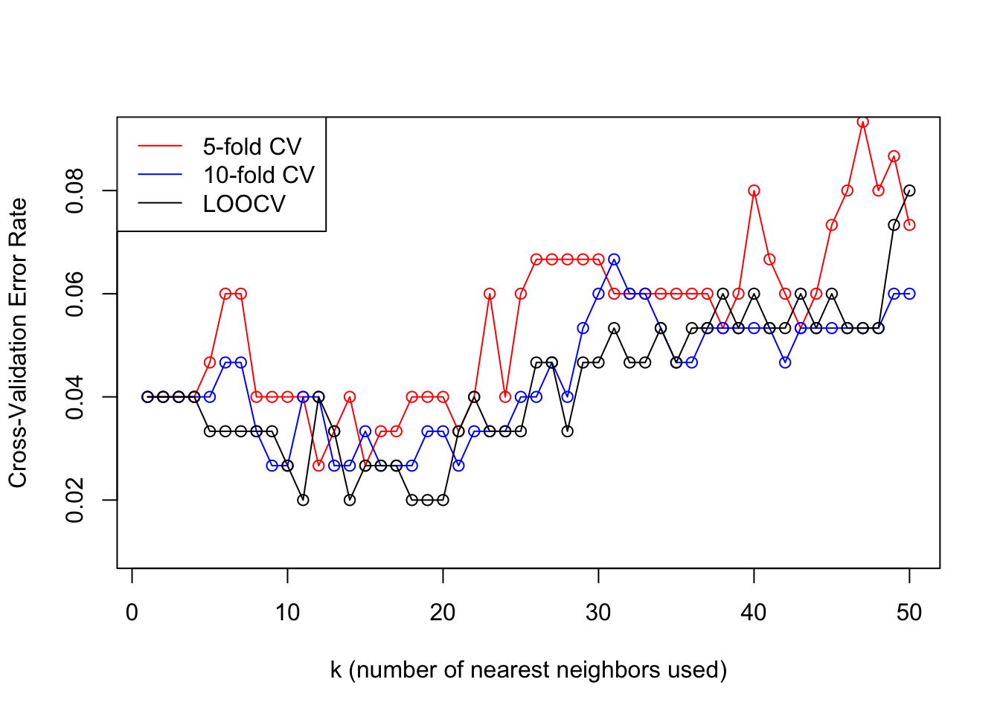

kNN Classification & Crossvalidation
================
2022-08-08

## Iris

### Load the Data

``` r
# import iris data
iris.data <- read.csv("https://archive.ics.uci.edu/ml/machine-learning-databases/iris/bezdekIris.data", 
                      header = FALSE, 
                      col.names = c("Sepal.Length", "Sepal.Width", "Petal.Length", "Petal.Width", "Species"))
```

### Look at the Data

``` r
head(iris.data)
```

    ##   Sepal.Length Sepal.Width Petal.Length Petal.Width     Species
    ## 1          5.1         3.5          1.4         0.2 Iris-setosa
    ## 2          4.9         3.0          1.4         0.2 Iris-setosa
    ## 3          4.7         3.2          1.3         0.2 Iris-setosa
    ## 4          4.6         3.1          1.5         0.2 Iris-setosa
    ## 5          5.0         3.6          1.4         0.2 Iris-setosa
    ## 6          5.4         3.9          1.7         0.4 Iris-setosa

``` r
iris.data[5] <- factor(iris.data[[5]])

str(iris.data)
```

    ## 'data.frame':    150 obs. of  5 variables:
    ##  $ Sepal.Length: num  5.1 4.9 4.7 4.6 5 5.4 4.6 5 4.4 4.9 ...
    ##  $ Sepal.Width : num  3.5 3 3.2 3.1 3.6 3.9 3.4 3.4 2.9 3.1 ...
    ##  $ Petal.Length: num  1.4 1.4 1.3 1.5 1.4 1.7 1.4 1.5 1.4 1.5 ...
    ##  $ Petal.Width : num  0.2 0.2 0.2 0.2 0.2 0.4 0.3 0.2 0.2 0.1 ...
    ##  $ Species     : Factor w/ 3 levels "Iris-setosa",..: 1 1 1 1 1 1 1 1 1 1 ...

``` r
summary(iris.data)
```

    ##   Sepal.Length    Sepal.Width     Petal.Length    Petal.Width   
    ##  Min.   :4.300   Min.   :2.000   Min.   :1.000   Min.   :0.100  
    ##  1st Qu.:5.100   1st Qu.:2.800   1st Qu.:1.600   1st Qu.:0.300  
    ##  Median :5.800   Median :3.000   Median :4.350   Median :1.300  
    ##  Mean   :5.843   Mean   :3.057   Mean   :3.758   Mean   :1.199  
    ##  3rd Qu.:6.400   3rd Qu.:3.300   3rd Qu.:5.100   3rd Qu.:1.800  
    ##  Max.   :7.900   Max.   :4.400   Max.   :6.900   Max.   :2.500  
    ##             Species  
    ##  Iris-setosa    :50  
    ##  Iris-versicolor:50  
    ##  Iris-virginica :50  
    ##                      
    ##                      
    ## 

``` r
pairs(~ ., data = iris.data[-5], 
      col = factor(iris.data[[5]])) # this would be clearer if used `Species` instead of `5` in the command
```


### Fit and Validate the `kNN` Model

I used the `caret` package for model fitting and crossvalidation

``` r
# load caret package
library(caret)
```

    ## Loading required package: ggplot2

    ## Loading required package: lattice

I tested 5-fold, 10-fold, and leave-one-out crossvalidation (CV)

``` r
# 5-fold, 10-fold, and leave-one-out (LOO) CV
numFolds <- c(5, 10, 150)

# list to store the different fits
fitList <- vector(mode = "list", length = length(numFolds))
names(fitList) <- numFolds

for(i in 1:length(numFolds)){
  trControl <- trainControl(method = "cv",
                            number = numFolds[i])

# vary the number of nearest neighbors k from 1 to 50  
fitList[[i]] <- train(Species ~ .,
                        method = "knn",
                        tuneGrid = expand.grid(k = 1:50),
                        trControl = trControl,
                        metric = "Accuracy",
                        data = iris.data)
}
```

    ## Warning in nominalTrainWorkflow(x = x, y = y, wts = weights, info = trainInfo, :
    ## There were missing values in resampled performance measures.

``` r
fitList
```

    ## $`5`
    ## k-Nearest Neighbors 
    ## 
    ## 150 samples
    ##   4 predictor
    ##   3 classes: 'Iris-setosa', 'Iris-versicolor', 'Iris-virginica' 
    ## 
    ## No pre-processing
    ## Resampling: Cross-Validated (5 fold) 
    ## Summary of sample sizes: 120, 120, 120, 120, 120 
    ## Resampling results across tuning parameters:
    ## 
    ##   k   Accuracy   Kappa
    ##    1  0.9533333  0.93 
    ##    2  0.9400000  0.91 
    ##    3  0.9466667  0.92 
    ##    4  0.9533333  0.93 
    ##    5  0.9600000  0.94 
    ##    6  0.9533333  0.93 
    ##    7  0.9600000  0.94 
    ##    8  0.9600000  0.94 
    ##    9  0.9666667  0.95 
    ##   10  0.9533333  0.93 
    ##   11  0.9600000  0.94 
    ##   12  0.9666667  0.95 
    ##   13  0.9600000  0.94 
    ##   14  0.9600000  0.94 
    ##   15  0.9600000  0.94 
    ##   16  0.9666667  0.95 
    ##   17  0.9600000  0.94 
    ##   18  0.9533333  0.93 
    ##   19  0.9600000  0.94 
    ##   20  0.9400000  0.91 
    ##   21  0.9466667  0.92 
    ##   22  0.9466667  0.92 
    ##   23  0.9400000  0.91 
    ##   24  0.9266667  0.89 
    ##   25  0.9333333  0.90 
    ##   26  0.9333333  0.90 
    ##   27  0.9333333  0.90 
    ##   28  0.9466667  0.92 
    ##   29  0.9400000  0.91 
    ##   30  0.9466667  0.92 
    ##   31  0.9400000  0.91 
    ##   32  0.9533333  0.93 
    ##   33  0.9400000  0.91 
    ##   34  0.9333333  0.90 
    ##   35  0.9533333  0.93 
    ##   36  0.9466667  0.92 
    ##   37  0.9533333  0.93 
    ##   38  0.9600000  0.94 
    ##   39  0.9400000  0.91 
    ##   40  0.9466667  0.92 
    ##   41  0.9266667  0.89 
    ##   42  0.9400000  0.91 
    ##   43  0.9333333  0.90 
    ##   44  0.9200000  0.88 
    ##   45  0.9400000  0.91 
    ##   46  0.9266667  0.89 
    ##   47  0.9266667  0.89 
    ##   48  0.9266667  0.89 
    ##   49  0.9200000  0.88 
    ##   50  0.9200000  0.88 
    ## 
    ## Accuracy was used to select the optimal model using the largest value.
    ## The final value used for the model was k = 16.
    ## 
    ## $`10`
    ## k-Nearest Neighbors 
    ## 
    ## 150 samples
    ##   4 predictor
    ##   3 classes: 'Iris-setosa', 'Iris-versicolor', 'Iris-virginica' 
    ## 
    ## No pre-processing
    ## Resampling: Cross-Validated (10 fold) 
    ## Summary of sample sizes: 135, 135, 135, 135, 135, 135, ... 
    ## Resampling results across tuning parameters:
    ## 
    ##   k   Accuracy   Kappa
    ##    1  0.9600000  0.94 
    ##    2  0.9466667  0.92 
    ##    3  0.9666667  0.95 
    ##    4  0.9733333  0.96 
    ##    5  0.9733333  0.96 
    ##    6  0.9733333  0.96 
    ##    7  0.9800000  0.97 
    ##    8  0.9800000  0.97 
    ##    9  0.9733333  0.96 
    ##   10  0.9666667  0.95 
    ##   11  0.9733333  0.96 
    ##   12  0.9733333  0.96 
    ##   13  0.9666667  0.95 
    ##   14  0.9800000  0.97 
    ##   15  0.9733333  0.96 
    ##   16  0.9733333  0.96 
    ##   17  0.9733333  0.96 
    ##   18  0.9666667  0.95 
    ##   19  0.9733333  0.96 
    ##   20  0.9666667  0.95 
    ##   21  0.9733333  0.96 
    ##   22  0.9733333  0.96 
    ##   23  0.9733333  0.96 
    ##   24  0.9733333  0.96 
    ##   25  0.9666667  0.95 
    ##   26  0.9733333  0.96 
    ##   27  0.9466667  0.92 
    ##   28  0.9400000  0.91 
    ##   29  0.9533333  0.93 
    ##   30  0.9400000  0.91 
    ##   31  0.9533333  0.93 
    ##   32  0.9600000  0.94 
    ##   33  0.9533333  0.93 
    ##   34  0.9600000  0.94 
    ##   35  0.9533333  0.93 
    ##   36  0.9466667  0.92 
    ##   37  0.9466667  0.92 
    ##   38  0.9466667  0.92 
    ##   39  0.9466667  0.92 
    ##   40  0.9533333  0.93 
    ##   41  0.9600000  0.94 
    ##   42  0.9533333  0.93 
    ##   43  0.9533333  0.93 
    ##   44  0.9466667  0.92 
    ##   45  0.9600000  0.94 
    ##   46  0.9466667  0.92 
    ##   47  0.9400000  0.91 
    ##   48  0.9333333  0.90 
    ##   49  0.9266667  0.89 
    ##   50  0.9333333  0.90 
    ## 
    ## Accuracy was used to select the optimal model using the largest value.
    ## The final value used for the model was k = 14.
    ## 
    ## $`150`
    ## k-Nearest Neighbors 
    ## 
    ## 150 samples
    ##   4 predictor
    ##   3 classes: 'Iris-setosa', 'Iris-versicolor', 'Iris-virginica' 
    ## 
    ## No pre-processing
    ## Resampling: Cross-Validated (150 fold) 
    ## Summary of sample sizes: 149, 149, 149, 149, 149, 149, ... 
    ## Resampling results across tuning parameters:
    ## 
    ##   k   Accuracy   Kappa
    ##    1  0.9600000  0    
    ##    2  0.9466667  0    
    ##    3  0.9600000  0    
    ##    4  0.9600000  0    
    ##    5  0.9666667  0    
    ##    6  0.9666667  0    
    ##    7  0.9666667  0    
    ##    8  0.9733333  0    
    ##    9  0.9666667  0    
    ##   10  0.9666667  0    
    ##   11  0.9733333  0    
    ##   12  0.9533333  0    
    ##   13  0.9666667  0    
    ##   14  0.9800000  0    
    ##   15  0.9733333  0    
    ##   16  0.9800000  0    
    ##   17  0.9733333  0    
    ##   18  0.9800000  0    
    ##   19  0.9733333  0    
    ##   20  0.9666667  0    
    ##   21  0.9733333  0    
    ##   22  0.9733333  0    
    ##   23  0.9666667  0    
    ##   24  0.9600000  0    
    ##   25  0.9666667  0    
    ##   26  0.9666667  0    
    ##   27  0.9600000  0    
    ##   28  0.9533333  0    
    ##   29  0.9533333  0    
    ##   30  0.9466667  0    
    ##   31  0.9466667  0    
    ##   32  0.9533333  0    
    ##   33  0.9533333  0    
    ##   34  0.9533333  0    
    ##   35  0.9533333  0    
    ##   36  0.9400000  0    
    ##   37  0.9466667  0    
    ##   38  0.9400000  0    
    ##   39  0.9533333  0    
    ##   40  0.9400000  0    
    ##   41  0.9466667  0    
    ##   42  0.9466667  0    
    ##   43  0.9400000  0    
    ##   44  0.9400000  0    
    ##   45  0.9400000  0    
    ##   46  0.9400000  0    
    ##   47  0.9466667  0    
    ##   48  0.9533333  0    
    ##   49  0.9400000  0    
    ##   50  0.9266667  0    
    ## 
    ## Accuracy was used to select the optimal model using the largest value.
    ## The final value used for the model was k = 18.

### Analyze Performance Metrics

Plot the results showing the comparison in performance

``` r
plot(1:50, 1-fitList[[1]]$results$Accuracy,
     type = "o", col = "red",
     xlab = "k (number of nearest neighbors used)", ylab = "Misclassification Error Rate")
points(1:50, 1-fitList[[2]]$results$Accuracy, type = "o", col = "blue")
points(1:50, 1-fitList[[3]]$results$Accuracy, type = "o", col = "black")
legend("topleft", legend = c("5-fold CV", "10-fold CV", "LOOCV"),
       col = c("red", "blue", "black"), lty = 1)
```



## USPS digits

``` r
library(tidyverse)
```

    ## ── Attaching packages ─────────────────────────────────────── tidyverse 1.3.1 ──

    ## ✔ tibble  3.1.7     ✔ dplyr   1.0.9
    ## ✔ tidyr   1.2.0     ✔ stringr 1.4.0
    ## ✔ readr   2.1.2     ✔ forcats 0.5.1
    ## ✔ purrr   0.3.4

    ## ── Conflicts ────────────────────────────────────────── tidyverse_conflicts() ──
    ## ✖ dplyr::filter() masks stats::filter()
    ## ✖ dplyr::lag()    masks stats::lag()
    ## ✖ purrr::lift()   masks caret::lift()

``` r
usps_train <- read_delim(
  "https://hastie.su.domains/ElemStatLearn/datasets/zip.train.gz", delim = " ", col_names = FALSE)
```

    ## Rows: 7291 Columns: 258

    ## ── Column specification ────────────────────────────────────────────────────────
    ## Delimiter: " "
    ## dbl (257): X1, X2, X3, X4, X5, X6, X7, X8, X9, X10, X11, X12, X13, X14, X15,...
    ## lgl   (1): X258
    ## 
    ## ℹ Use `spec()` to retrieve the full column specification for this data.
    ## ℹ Specify the column types or set `show_col_types = FALSE` to quiet this message.

``` r
str(usps_train)
```

    ## spec_tbl_df [7,291 × 258] (S3: spec_tbl_df/tbl_df/tbl/data.frame)
    ##  $ X1  : num [1:7291] 6 5 4 7 3 6 3 1 0 1 ...
    ##  $ X2  : num [1:7291] -1 -1 -1 -1 -1 -1 -1 -1 -1 -1 ...
    ##  $ X3  : num [1:7291] -1 -1 -1 -1 -1 -1 -1 -1 -1 -1 ...
    ##  $ X4  : num [1:7291] -1 -1 -1 -1 -1 -1 -1 -1 -1 -1 ...
    ##  $ X5  : num [1:7291] -1 -0.813 -1 -1 -1 -1 -0.83 -1 -1 -1 ...
    ##  $ X6  : num [1:7291] -1 -0.671 -1 -1 -1 -1 0.442 -1 -1 -1 ...
    ##  $ X7  : num [1:7291] -1 -0.809 -1 -0.273 -0.928 -0.397 1 -1 -0.454 -1 ...
    ##  $ X8  : num [1:7291] -1 -0.887 -1 0.684 -0.204 0.983 1 -1 0.879 -1 ...
    ##  $ X9  : num [1:7291] -0.631 -0.671 -1 0.96 0.751 -0.535 0.479 0.51 -0.745 -0.909 ...
    ##  $ X10 : num [1:7291] 0.862 -0.853 -1 0.45 0.466 -1 -0.328 -0.213 -1 0.801 ...
    ##  $ X11 : num [1:7291] -0.167 -1 -0.996 -0.067 0.234 -1 -0.947 -1 -1 -0.899 ...
    ##  $ X12 : num [1:7291] -1 -1 0.147 -0.679 -0.809 -1 -1 -1 -1 -1 ...
    ##  $ X13 : num [1:7291] -1 -0.774 1 -1 -1 -1 -1 -1 -1 -1 ...
    ##  $ X14 : num [1:7291] -1 -0.18 -0.189 -1 -1 -1 -1 -1 -1 -1 ...
    ##  $ X15 : num [1:7291] -1 0.052 -1 -1 -1 -1 -1 -1 -1 -1 ...
    ##  $ X16 : num [1:7291] -1 -0.241 -1 -1 -1 -1 -1 -1 -1 -1 ...
    ##  $ X17 : num [1:7291] -1 -1 -1 -1 -1 -1 -1 -1 -1 -1 ...
    ##  $ X18 : num [1:7291] -1 -1 -1 -1 -1 -1 -1 -1 -1 -1 ...
    ##  $ X19 : num [1:7291] -1 -1 -1 -1 -1 -1 -1 -1 -1 -1 ...
    ##  $ X20 : num [1:7291] -1 -1 -1 -1 -1 -1 -1 -1 -1 -1 ...
    ##  $ X21 : num [1:7291] -1 0.392 -1 -1 -1 -1 -0.025 -1 -1 -1 ...
    ##  $ X22 : num [1:7291] -1 1 -1 -0.114 -0.37 -1 0.519 -1 -0.716 -1 ...
    ##  $ X23 : num [1:7291] -1 0.857 -1 0.974 0.739 0.692 0.124 -1 0.804 -1 ...
    ##  $ X24 : num [1:7291] -0.992 0.727 -1 0.917 1 0.536 0.339 -1 1 -1 ...
    ##  $ X25 : num [1:7291] 0.297 1 -1 0.734 1 -0.767 0.762 0.292 0.42 -0.405 ...
    ##  $ X26 : num [1:7291] 1 0.805 -1 0.994 1 -1 1 0.792 -0.664 1 ...
    ##  $ X27 : num [1:7291] 0.307 0.613 -0.882 1 1 -1 0.456 -0.987 -1 -0.396 ...
    ##  $ X28 : num [1:7291] -1 0.613 1 0.973 0.644 -1 -0.707 -1 -1 -1 ...
    ##  $ X29 : num [1:7291] -1 0.86 0.39 0.391 -0.89 -1 -1 -1 -1 -1 ...
    ##  $ X30 : num [1:7291] -1 1 -0.811 -0.421 -1 -1 -1 -1 -1 -1 ...
    ##  $ X31 : num [1:7291] -1 1 -1 -0.976 -1 -1 -1 -1 -1 -1 ...
    ##  $ X32 : num [1:7291] -1 0.396 -1 -1 -1 -1 -1 -1 -1 -1 ...
    ##  $ X33 : num [1:7291] -1 -1 -1 -1 -1 -1 -1 -1 -1 -1 ...
    ##  $ X34 : num [1:7291] -1 -1 -1 -1 -1 -1 -1 -1 -1 -1 ...
    ##  $ X35 : num [1:7291] -1 -1 -1 -1 -1 -1 -1 -1 -1 -1 ...
    ##  $ X36 : num [1:7291] -1 -1 -1 -1 -1 -1 -1 -1 -1 -1 ...
    ##  $ X37 : num [1:7291] -1 -0.548 -1 -0.323 -1 -1 -1 -1 -0.978 -1 ...
    ##  $ X38 : num [1:7291] -1 1 -1 0.991 0.616 -0.921 -1 -1 0.713 -1 ...
    ##  $ X39 : num [1:7291] -1 1 -1 0.622 1 0.928 -1 -1 1 -1 ...
    ##  $ X40 : num [1:7291] -0.41 1 -1 -0.738 0.688 -0.118 -1 -1 0.027 -1 ...
    ##  $ X41 : num [1:7291] 1 1 -1 -1 -0.455 -1 -0.965 0.56 0.408 -0.072 ...
    ##  $ X42 : num [1:7291] 0.986 1 -1 -0.639 -0.731 -1 -0.086 0.975 0.947 1 ...
    ##  $ X43 : num [1:7291] -0.565 1 -0.715 0.023 0.659 -1 0.843 -0.873 0.56 -0.468 ...
    ##  $ X44 : num [1:7291] -1 1 1 0.871 1 -1 0.681 -1 -0.538 -1 ...
    ##  $ X45 : num [1:7291] -1 1 0.029 1 -0.287 -1 -0.955 -1 -1 -1 ...
    ##  $ X46 : num [1:7291] -1 1 -1 1 -1 -1 -1 -1 -1 -1 ...
    ##  $ X47 : num [1:7291] -1 1 -1 -0.432 -1 -1 -1 -1 -1 -1 ...
    ##  $ X48 : num [1:7291] -1 0.875 -1 -1 -1 -1 -1 -1 -1 -1 ...
    ##  $ X49 : num [1:7291] -1 -0.957 -1 -1 -1 -1 -1 -1 -1 -1 ...
    ##  $ X50 : num [1:7291] -1 -1 -1 -1 -1 -1 -1 -1 -1 -1 ...
    ##  $ X51 : num [1:7291] -1 -1 -1 -1 -1 -1 -1 -1 -1 -1 ...
    ##  $ X52 : num [1:7291] -1 -1 -1 -1 -1 -1 -1 -1 -1 -1 ...
    ##  $ X53 : num [1:7291] -1 -0.786 -1 0.409 -1 -1 -1 -1 -0.118 -1 ...
    ##  $ X54 : num [1:7291] -1 0.961 -0.888 1 -0.376 -0.394 -1 -1 1 -1 ...
    ##  $ X55 : num [1:7291] -0.683 1 -0.912 0 -0.186 1 -1 -1 0.665 -1 ...
    ##  $ X56 : num [1:7291] 0.825 1 -1 -1 -0.874 -0.596 -1 -1 -0.902 -1 ...
    ##  $ X57 : num [1:7291] 1 1 -1 -1 -1 -1 -1 0.745 -0.969 0.057 ...
    ##  $ X58 : num [1:7291] 0.562 0.727 -1 -1 -1 -1 -1 0.999 -0.36 1 ...
    ##  $ X59 : num [1:7291] -1 0.403 -0.549 -1 -0.014 -1 -0.467 -0.748 0.805 -0.623 ...
    ##  $ X60 : num [1:7291] -1 0.403 1 -0.842 1 -1 1 -1 0.987 -1 ...
    ##  $ X61 : num [1:7291] -1 0.171 0.361 0.714 -0.253 -1 -0.279 -1 0.327 -1 ...
    ##  $ X62 : num [1:7291] -1 -0.314 -1 1 -1 -1 -1 -1 -0.797 -1 ...
    ##  $ X63 : num [1:7291] -1 -0.314 -1 -0.534 -1 -1 -1 -1 -1 -1 ...
    ##  $ X64 : num [1:7291] -1 -0.94 -1 -1 -1 -1 -1 -1 -1 -1 ...
    ##  $ X65 : num [1:7291] -1 -1 -1 -1 -1 -1 -1 -1 -1 -1 ...
    ##  $ X66 : num [1:7291] -1 -1 -1 -1 -1 -1 -1 -1 -1 -1 ...
    ##  $ X67 : num [1:7291] -1 -1 -1 -1 -1 -1 -1 -1 -1 -1 ...
    ##  $ X68 : num [1:7291] -1 -1 -1 -0.879 -1 -1 -1 -1 -0.935 -1 ...
    ##  $ X69 : num [1:7291] -1 -0.298 -0.938 0.965 -1 -1 -1 -1 0.764 -1 ...
    ##  $ X70 : num [1:7291] -0.938 1 0.694 1 -1 0.06 -1 -1 1 -1 ...
    ##  $ X71 : num [1:7291] 0.54 1 0.057 -0.713 -1 0.9 -1 -1 -0.367 -1 ...
    ##  $ X72 : num [1:7291] 1 1 -1 -1 -1 -0.951 -1 -1 -1 -1 ...
    ##  $ X73 : num [1:7291] 0.778 0.44 -1 -1 -1 -1 -1 0.596 -1 0.288 ...
    ##  $ X74 : num [1:7291] -0.715 0.056 -1 -1 -0.978 -1 -1 1 -1 1 ...
    ##  $ X75 : num [1:7291] -1 -0.755 -0.382 -1 0.501 -1 -0.719 -0.601 -0.914 -0.683 ...
    ##  $ X76 : num [1:7291] -1 -1 1 -0.606 1 -0.647 1 -1 -0.256 -1 ...
    ##  $ X77 : num [1:7291] -1 -1 0.511 0.977 -0.54 0.455 -0.203 -1 0.833 -1 ...
    ##  $ X78 : num [1:7291] -1 -1 -1 0.695 -1 -0.333 -1 -1 0.778 -1 ...
    ##  $ X79 : num [1:7291] -1 -1 -1 -0.906 -1 -1 -1 -1 -0.22 -1 ...
    ##  $ X80 : num [1:7291] -1 -1 -1 -1 -1 -1 -1 -1 -0.992 -1 ...
    ##  $ X81 : num [1:7291] -1 -1 -1 -1 -1 -1 -1 -1 -1 -1 ...
    ##  $ X82 : num [1:7291] -1 -1 -1 -1 -1 -1 -1 -1 -1 -1 ...
    ##  $ X83 : num [1:7291] -1 -1 -1 -1 -1 -1 -1 -1 -1 -1 ...
    ##  $ X84 : num [1:7291] -1 -1 -1 -0.528 -1 -1 -1 -1 -0.256 -1 ...
    ##  $ X85 : num [1:7291] -1 0.366 -0.311 1 -1 -1 -1 -1 1 -1 ...
    ##  $ X86 : num [1:7291] 0.1 1 1 0.931 -1 0.259 -1 -1 0.538 -1 ...
    ##  $ X87 : num [1:7291] 1 1 -0.043 -0.888 -0.998 0.676 -1 -1 -0.986 -1 ...
    ##  $ X88 : num [1:7291] 0.922 1 -1 -1 -0.341 -1 -1 -1 -1 -1 ...
    ##  $ X89 : num [1:7291] -0.439 1 -1 -1 0.296 -1 -1 0.714 -1 0.253 ...
    ##  $ X90 : num [1:7291] -1 1 -1 -1 0.371 -1 -0.786 1 -1 1 ...
    ##  $ X91 : num [1:7291] -1 0.889 -0.648 -0.949 1 -0.984 0.504 -0.585 -1 -0.647 ...
    ##  $ X92 : num [1:7291] -1 -0.081 1 0.559 0.417 0.677 0.945 -1 -1 -1 ...
    ##  $ X93 : num [1:7291] -1 -0.92 0.644 0.984 -0.989 0.981 -0.801 -1 -0.837 -1 ...
    ##  $ X94 : num [1:7291] -1 -1 -1 -0.363 -1 0.551 -1 -1 0.551 -1 ...
    ##  $ X95 : num [1:7291] -1 -1 -1 -1 -1 -1 -1 -1 1 -1 ...
    ##  $ X96 : num [1:7291] -1 -1 -1 -1 -1 -1 -1 -1 -0.285 -1 ...
    ##  $ X97 : num [1:7291] -1 -1 -1 -1 -1 -1 -1 -1 -1 -1 ...
    ##  $ X98 : num [1:7291] -1 -1 -1 -1 -1 -1 -1 -1 -1 -1 ...
    ##  $ X99 : num [1:7291] -1 -1 -1 -1 -1 -1 -1 -1 -0.936 -1 ...
    ##   [list output truncated]
    ##  - attr(*, "spec")=
    ##   .. cols(
    ##   ..   X1 = col_double(),
    ##   ..   X2 = col_double(),
    ##   ..   X3 = col_double(),
    ##   ..   X4 = col_double(),
    ##   ..   X5 = col_double(),
    ##   ..   X6 = col_double(),
    ##   ..   X7 = col_double(),
    ##   ..   X8 = col_double(),
    ##   ..   X9 = col_double(),
    ##   ..   X10 = col_double(),
    ##   ..   X11 = col_double(),
    ##   ..   X12 = col_double(),
    ##   ..   X13 = col_double(),
    ##   ..   X14 = col_double(),
    ##   ..   X15 = col_double(),
    ##   ..   X16 = col_double(),
    ##   ..   X17 = col_double(),
    ##   ..   X18 = col_double(),
    ##   ..   X19 = col_double(),
    ##   ..   X20 = col_double(),
    ##   ..   X21 = col_double(),
    ##   ..   X22 = col_double(),
    ##   ..   X23 = col_double(),
    ##   ..   X24 = col_double(),
    ##   ..   X25 = col_double(),
    ##   ..   X26 = col_double(),
    ##   ..   X27 = col_double(),
    ##   ..   X28 = col_double(),
    ##   ..   X29 = col_double(),
    ##   ..   X30 = col_double(),
    ##   ..   X31 = col_double(),
    ##   ..   X32 = col_double(),
    ##   ..   X33 = col_double(),
    ##   ..   X34 = col_double(),
    ##   ..   X35 = col_double(),
    ##   ..   X36 = col_double(),
    ##   ..   X37 = col_double(),
    ##   ..   X38 = col_double(),
    ##   ..   X39 = col_double(),
    ##   ..   X40 = col_double(),
    ##   ..   X41 = col_double(),
    ##   ..   X42 = col_double(),
    ##   ..   X43 = col_double(),
    ##   ..   X44 = col_double(),
    ##   ..   X45 = col_double(),
    ##   ..   X46 = col_double(),
    ##   ..   X47 = col_double(),
    ##   ..   X48 = col_double(),
    ##   ..   X49 = col_double(),
    ##   ..   X50 = col_double(),
    ##   ..   X51 = col_double(),
    ##   ..   X52 = col_double(),
    ##   ..   X53 = col_double(),
    ##   ..   X54 = col_double(),
    ##   ..   X55 = col_double(),
    ##   ..   X56 = col_double(),
    ##   ..   X57 = col_double(),
    ##   ..   X58 = col_double(),
    ##   ..   X59 = col_double(),
    ##   ..   X60 = col_double(),
    ##   ..   X61 = col_double(),
    ##   ..   X62 = col_double(),
    ##   ..   X63 = col_double(),
    ##   ..   X64 = col_double(),
    ##   ..   X65 = col_double(),
    ##   ..   X66 = col_double(),
    ##   ..   X67 = col_double(),
    ##   ..   X68 = col_double(),
    ##   ..   X69 = col_double(),
    ##   ..   X70 = col_double(),
    ##   ..   X71 = col_double(),
    ##   ..   X72 = col_double(),
    ##   ..   X73 = col_double(),
    ##   ..   X74 = col_double(),
    ##   ..   X75 = col_double(),
    ##   ..   X76 = col_double(),
    ##   ..   X77 = col_double(),
    ##   ..   X78 = col_double(),
    ##   ..   X79 = col_double(),
    ##   ..   X80 = col_double(),
    ##   ..   X81 = col_double(),
    ##   ..   X82 = col_double(),
    ##   ..   X83 = col_double(),
    ##   ..   X84 = col_double(),
    ##   ..   X85 = col_double(),
    ##   ..   X86 = col_double(),
    ##   ..   X87 = col_double(),
    ##   ..   X88 = col_double(),
    ##   ..   X89 = col_double(),
    ##   ..   X90 = col_double(),
    ##   ..   X91 = col_double(),
    ##   ..   X92 = col_double(),
    ##   ..   X93 = col_double(),
    ##   ..   X94 = col_double(),
    ##   ..   X95 = col_double(),
    ##   ..   X96 = col_double(),
    ##   ..   X97 = col_double(),
    ##   ..   X98 = col_double(),
    ##   ..   X99 = col_double(),
    ##   ..   X100 = col_double(),
    ##   ..   X101 = col_double(),
    ##   ..   X102 = col_double(),
    ##   ..   X103 = col_double(),
    ##   ..   X104 = col_double(),
    ##   ..   X105 = col_double(),
    ##   ..   X106 = col_double(),
    ##   ..   X107 = col_double(),
    ##   ..   X108 = col_double(),
    ##   ..   X109 = col_double(),
    ##   ..   X110 = col_double(),
    ##   ..   X111 = col_double(),
    ##   ..   X112 = col_double(),
    ##   ..   X113 = col_double(),
    ##   ..   X114 = col_double(),
    ##   ..   X115 = col_double(),
    ##   ..   X116 = col_double(),
    ##   ..   X117 = col_double(),
    ##   ..   X118 = col_double(),
    ##   ..   X119 = col_double(),
    ##   ..   X120 = col_double(),
    ##   ..   X121 = col_double(),
    ##   ..   X122 = col_double(),
    ##   ..   X123 = col_double(),
    ##   ..   X124 = col_double(),
    ##   ..   X125 = col_double(),
    ##   ..   X126 = col_double(),
    ##   ..   X127 = col_double(),
    ##   ..   X128 = col_double(),
    ##   ..   X129 = col_double(),
    ##   ..   X130 = col_double(),
    ##   ..   X131 = col_double(),
    ##   ..   X132 = col_double(),
    ##   ..   X133 = col_double(),
    ##   ..   X134 = col_double(),
    ##   ..   X135 = col_double(),
    ##   ..   X136 = col_double(),
    ##   ..   X137 = col_double(),
    ##   ..   X138 = col_double(),
    ##   ..   X139 = col_double(),
    ##   ..   X140 = col_double(),
    ##   ..   X141 = col_double(),
    ##   ..   X142 = col_double(),
    ##   ..   X143 = col_double(),
    ##   ..   X144 = col_double(),
    ##   ..   X145 = col_double(),
    ##   ..   X146 = col_double(),
    ##   ..   X147 = col_double(),
    ##   ..   X148 = col_double(),
    ##   ..   X149 = col_double(),
    ##   ..   X150 = col_double(),
    ##   ..   X151 = col_double(),
    ##   ..   X152 = col_double(),
    ##   ..   X153 = col_double(),
    ##   ..   X154 = col_double(),
    ##   ..   X155 = col_double(),
    ##   ..   X156 = col_double(),
    ##   ..   X157 = col_double(),
    ##   ..   X158 = col_double(),
    ##   ..   X159 = col_double(),
    ##   ..   X160 = col_double(),
    ##   ..   X161 = col_double(),
    ##   ..   X162 = col_double(),
    ##   ..   X163 = col_double(),
    ##   ..   X164 = col_double(),
    ##   ..   X165 = col_double(),
    ##   ..   X166 = col_double(),
    ##   ..   X167 = col_double(),
    ##   ..   X168 = col_double(),
    ##   ..   X169 = col_double(),
    ##   ..   X170 = col_double(),
    ##   ..   X171 = col_double(),
    ##   ..   X172 = col_double(),
    ##   ..   X173 = col_double(),
    ##   ..   X174 = col_double(),
    ##   ..   X175 = col_double(),
    ##   ..   X176 = col_double(),
    ##   ..   X177 = col_double(),
    ##   ..   X178 = col_double(),
    ##   ..   X179 = col_double(),
    ##   ..   X180 = col_double(),
    ##   ..   X181 = col_double(),
    ##   ..   X182 = col_double(),
    ##   ..   X183 = col_double(),
    ##   ..   X184 = col_double(),
    ##   ..   X185 = col_double(),
    ##   ..   X186 = col_double(),
    ##   ..   X187 = col_double(),
    ##   ..   X188 = col_double(),
    ##   ..   X189 = col_double(),
    ##   ..   X190 = col_double(),
    ##   ..   X191 = col_double(),
    ##   ..   X192 = col_double(),
    ##   ..   X193 = col_double(),
    ##   ..   X194 = col_double(),
    ##   ..   X195 = col_double(),
    ##   ..   X196 = col_double(),
    ##   ..   X197 = col_double(),
    ##   ..   X198 = col_double(),
    ##   ..   X199 = col_double(),
    ##   ..   X200 = col_double(),
    ##   ..   X201 = col_double(),
    ##   ..   X202 = col_double(),
    ##   ..   X203 = col_double(),
    ##   ..   X204 = col_double(),
    ##   ..   X205 = col_double(),
    ##   ..   X206 = col_double(),
    ##   ..   X207 = col_double(),
    ##   ..   X208 = col_double(),
    ##   ..   X209 = col_double(),
    ##   ..   X210 = col_double(),
    ##   ..   X211 = col_double(),
    ##   ..   X212 = col_double(),
    ##   ..   X213 = col_double(),
    ##   ..   X214 = col_double(),
    ##   ..   X215 = col_double(),
    ##   ..   X216 = col_double(),
    ##   ..   X217 = col_double(),
    ##   ..   X218 = col_double(),
    ##   ..   X219 = col_double(),
    ##   ..   X220 = col_double(),
    ##   ..   X221 = col_double(),
    ##   ..   X222 = col_double(),
    ##   ..   X223 = col_double(),
    ##   ..   X224 = col_double(),
    ##   ..   X225 = col_double(),
    ##   ..   X226 = col_double(),
    ##   ..   X227 = col_double(),
    ##   ..   X228 = col_double(),
    ##   ..   X229 = col_double(),
    ##   ..   X230 = col_double(),
    ##   ..   X231 = col_double(),
    ##   ..   X232 = col_double(),
    ##   ..   X233 = col_double(),
    ##   ..   X234 = col_double(),
    ##   ..   X235 = col_double(),
    ##   ..   X236 = col_double(),
    ##   ..   X237 = col_double(),
    ##   ..   X238 = col_double(),
    ##   ..   X239 = col_double(),
    ##   ..   X240 = col_double(),
    ##   ..   X241 = col_double(),
    ##   ..   X242 = col_double(),
    ##   ..   X243 = col_double(),
    ##   ..   X244 = col_double(),
    ##   ..   X245 = col_double(),
    ##   ..   X246 = col_double(),
    ##   ..   X247 = col_double(),
    ##   ..   X248 = col_double(),
    ##   ..   X249 = col_double(),
    ##   ..   X250 = col_double(),
    ##   ..   X251 = col_double(),
    ##   ..   X252 = col_double(),
    ##   ..   X253 = col_double(),
    ##   ..   X254 = col_double(),
    ##   ..   X255 = col_double(),
    ##   ..   X256 = col_double(),
    ##   ..   X257 = col_double(),
    ##   ..   X258 = col_logical()
    ##   .. )
    ##  - attr(*, "problems")=<externalptr>

``` r
(usps_train_labels <- usps_train[, 1])
```

    ## # A tibble: 7,291 × 1
    ##       X1
    ##    <dbl>
    ##  1     6
    ##  2     5
    ##  3     4
    ##  4     7
    ##  5     3
    ##  6     6
    ##  7     3
    ##  8     1
    ##  9     0
    ## 10     1
    ## # … with 7,281 more rows

## R Markdown

This is an R Markdown document. Markdown is a simple formatting syntax
for authoring HTML, PDF, and MS Word documents. For more details on
using R Markdown see <http://rmarkdown.rstudio.com>.

When you click the **Knit** button a document will be generated that
includes both content as well as the output of any embedded R code
chunks within the document. You can embed an R code chunk like this:

``` r
summary(cars)
```

    ##      speed           dist       
    ##  Min.   : 4.0   Min.   :  2.00  
    ##  1st Qu.:12.0   1st Qu.: 26.00  
    ##  Median :15.0   Median : 36.00  
    ##  Mean   :15.4   Mean   : 42.98  
    ##  3rd Qu.:19.0   3rd Qu.: 56.00  
    ##  Max.   :25.0   Max.   :120.00

## Including Plots

You can also embed plots, for example:


Note that the `echo = FALSE` parameter was added to the code chunk to
prevent printing of the R code that generated the plot.
