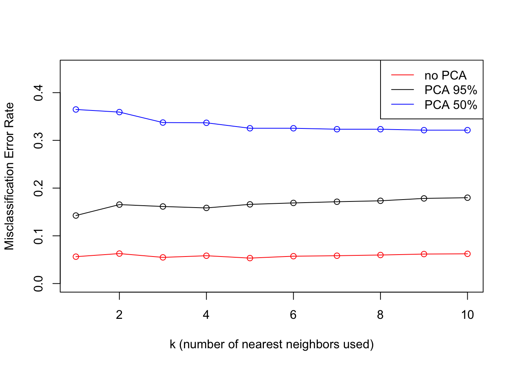
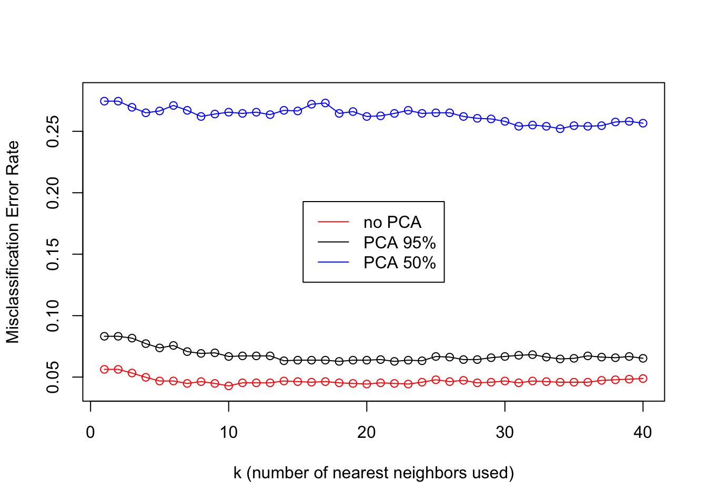

Dimension Reduction: Principal Component Analysis (PCA)
================
2022-10-24

# PCA for Visualization

## Load MNIST Dataset

``` r
library(keras)

mnist <- dataset_mnist()
train_x <- mnist$train$x
train_y <- mnist$train$y
test_x <- mnist$test$x
test_y <- mnist$test$y
```

## Look at the data

``` r
table(train_y)
```

    ## train_y
    ##    0    1    2    3    4    5    6    7    8    9 
    ## 5923 6742 5958 6131 5842 5421 5918 6265 5851 5949

``` r
table(test_y)
```

    ## test_y
    ##    0    1    2    3    4    5    6    7    8    9 
    ##  980 1135 1032 1010  982  892  958 1028  974 1009

## PCA visualization of 0, 1, and 0 and 1 combined

``` r
# convert `train_x` and `test_x` from array to matrix
train_x <- matrix(train_x, ncol = 784)
test_x <- matrix(test_x, ncol = 784)

# select 0 and 1 from train_x
train_0 <- train_x[train_y == 0, ]
train_1 <- train_x[train_y == 1, ]
train_0_1 <- rbind(train_0, train_1)
train_0_1_labels <- c(rep(0, times = nrow(train_0)), rep(1, times = nrow(train_1)))

# PCA, center, no scale
train_0_pca <- prcomp(train_0)

plot(train_0_pca$x[, 1], train_0_pca$x[, 2],
      col = 1,
      main = "MNIST Dataset - 0 Only",
      xlab = "First Principal Component", ylab = "Second Principal Component")
```


``` r
# PCA, center, no scale
train_1_pca <- prcomp(train_1)

plot(train_1_pca$x[, 1], train_1_pca$x[, 2],
        col = 2,
        main = "MNIST Dataset - 1 Only",
        xlab = "First Principal Component", ylab = "Second Principal Component")
```


``` r
train_0_1_pca <- prcomp(train_0_1)

plot(train_0_1_pca$x[, 1], train_0_1_pca$x[, 2],
        col = factor(train_0_1_labels),
        main = "MNIST Dataset - 0 & 1",
        xlab = "First Principal Component", ylab = "Second Principal Component")

legend("topright", legend = levels(factor(train_0_1_labels)), fill = c(1:2))
```


# PCA as Pre-Processing for kNN Classification: USPS digits

We compare 50% variance PCA, 95% variance PCA, and no PCA, as
pre-processing for kNN classification of the USPS digits datasets

## Load the data

``` r
library(tidyverse)
usps_train <- read_delim(
  "https://hastie.su.domains/ElemStatLearn/datasets/zip.train.gz", 
  delim = " ", col_names = FALSE, show_col_types = FALSE)
usps_test <- read_delim(
  "https://hastie.su.domains/ElemStatLearn/datasets/zip.test.gz", 
  delim = " ", col_names = FALSE, show_col_types = FALSE)

# convert to matrix
usps_train <- as.matrix(usps_train)
usps_test <- as.matrix(usps_test)

# first column contains labels
usps_train_labels <- factor(usps_train[, 1])
usps_test_labels <- factor(usps_test[, 1])

# drop label column of usps_train and usps_test
usps_train <- usps_train[, -1]
usps_test <- usps_test[, -1]

# drop last column (all NA) of usps_train
usps_train <- usps_train[, -257]
```

How many PCs required to explain 50% of variance? 95% of variance?

``` r
usps_train_pca <- prcomp(usps_train, center = TRUE, scale = TRUE)
summary(usps_train_pca)
```

    ## Importance of components:
    ##                           PC1    PC2     PC3     PC4     PC5     PC6     PC7
    ## Standard deviation     6.2002 4.3643 4.17926 3.64931 3.32097 3.08502 2.94906
    ## Proportion of Variance 0.1502 0.0744 0.06823 0.05202 0.04308 0.03718 0.03397
    ## Cumulative Proportion  0.1502 0.2246 0.29280 0.34482 0.38790 0.42508 0.45905
    ##                            PC8     PC9    PC10   PC11    PC12    PC13    PC14
    ## Standard deviation     2.79404 2.49451 2.32121 2.2683 2.18961 2.09150 1.94344
    ## Proportion of Variance 0.03049 0.02431 0.02105 0.0201 0.01873 0.01709 0.01475
    ## Cumulative Proportion  0.48954 0.51385 0.53490 0.5550 0.57372 0.59081 0.60557
    ##                           PC15   PC16    PC17    PC18    PC19    PC20    PC21
    ## Standard deviation     1.88841 1.8243 1.79065 1.76785 1.70191 1.65828 1.60519
    ## Proportion of Variance 0.01393 0.0130 0.01253 0.01221 0.01131 0.01074 0.01007
    ## Cumulative Proportion  0.61950 0.6325 0.64502 0.65723 0.66854 0.67929 0.68935
    ##                           PC22    PC23    PC24    PC25    PC26    PC27    PC28
    ## Standard deviation     1.56378 1.55691 1.46819 1.43661 1.41260 1.36980 1.35007
    ## Proportion of Variance 0.00955 0.00947 0.00842 0.00806 0.00779 0.00733 0.00712
    ## Cumulative Proportion  0.69890 0.70837 0.71679 0.72485 0.73265 0.73998 0.74710
    ##                           PC29    PC30    PC31    PC32    PC33    PC34    PC35
    ## Standard deviation     1.32321 1.28938 1.27501 1.25238 1.22014 1.19814 1.17273
    ## Proportion of Variance 0.00684 0.00649 0.00635 0.00613 0.00582 0.00561 0.00537
    ## Cumulative Proportion  0.75394 0.76043 0.76678 0.77291 0.77872 0.78433 0.78970
    ##                           PC36    PC37    PC38    PC39    PC40    PC41    PC42
    ## Standard deviation     1.14978 1.11162 1.10563 1.10161 1.07646 1.06215 1.03272
    ## Proportion of Variance 0.00516 0.00483 0.00478 0.00474 0.00453 0.00441 0.00417
    ## Cumulative Proportion  0.79487 0.79969 0.80447 0.80921 0.81374 0.81814 0.82231
    ##                           PC43    PC44    PC45    PC46    PC47   PC48    PC49
    ## Standard deviation     1.02735 1.01902 0.99625 0.99144 0.97908 0.9604 0.94131
    ## Proportion of Variance 0.00412 0.00406 0.00388 0.00384 0.00374 0.0036 0.00346
    ## Cumulative Proportion  0.82643 0.83049 0.83437 0.83821 0.84195 0.8456 0.84901
    ##                           PC50    PC51   PC52    PC53    PC54    PC55    PC56
    ## Standard deviation     0.93575 0.91483 0.9045 0.89649 0.87157 0.86370 0.85159
    ## Proportion of Variance 0.00342 0.00327 0.0032 0.00314 0.00297 0.00291 0.00283
    ## Cumulative Proportion  0.85243 0.85570 0.8589 0.86204 0.86501 0.86792 0.87075
    ##                           PC57    PC58    PC59    PC60    PC61    PC62    PC63
    ## Standard deviation     0.82839 0.82428 0.81003 0.79886 0.78722 0.77575 0.76599
    ## Proportion of Variance 0.00268 0.00265 0.00256 0.00249 0.00242 0.00235 0.00229
    ## Cumulative Proportion  0.87343 0.87609 0.87865 0.88114 0.88356 0.88592 0.88821
    ##                           PC64    PC65    PC66    PC67    PC68    PC69    PC70
    ## Standard deviation     0.75694 0.75528 0.74491 0.72860 0.72541 0.71968 0.70640
    ## Proportion of Variance 0.00224 0.00223 0.00217 0.00207 0.00206 0.00202 0.00195
    ## Cumulative Proportion  0.89045 0.89267 0.89484 0.89691 0.89897 0.90099 0.90294
    ##                           PC71    PC72   PC73    PC74    PC75    PC76    PC77
    ## Standard deviation     0.70376 0.68343 0.6782 0.67115 0.65749 0.64981 0.64714
    ## Proportion of Variance 0.00193 0.00182 0.0018 0.00176 0.00169 0.00165 0.00164
    ## Cumulative Proportion  0.90488 0.90670 0.9085 0.91026 0.91195 0.91360 0.91523
    ##                           PC78    PC79    PC80    PC81   PC82    PC83    PC84
    ## Standard deviation     0.64251 0.63669 0.62842 0.62534 0.6189 0.61239 0.60086
    ## Proportion of Variance 0.00161 0.00158 0.00154 0.00153 0.0015 0.00146 0.00141
    ## Cumulative Proportion  0.91685 0.91843 0.91997 0.92150 0.9230 0.92446 0.92587
    ##                           PC85    PC86    PC87    PC88    PC89    PC90    PC91
    ## Standard deviation     0.58563 0.58350 0.57995 0.56731 0.55838 0.55575 0.54638
    ## Proportion of Variance 0.00134 0.00133 0.00131 0.00126 0.00122 0.00121 0.00117
    ## Cumulative Proportion  0.92721 0.92854 0.92985 0.93111 0.93233 0.93354 0.93470
    ##                           PC92    PC93   PC94    PC95    PC96    PC97    PC98
    ## Standard deviation     0.54533 0.53832 0.5309 0.52820 0.52201 0.51569 0.51162
    ## Proportion of Variance 0.00116 0.00113 0.0011 0.00109 0.00106 0.00104 0.00102
    ## Cumulative Proportion  0.93586 0.93700 0.9381 0.93919 0.94025 0.94129 0.94231
    ##                          PC99   PC100   PC101   PC102   PC103   PC104  PC105
    ## Standard deviation     0.5063 0.50200 0.49824 0.49732 0.48763 0.48443 0.4810
    ## Proportion of Variance 0.0010 0.00098 0.00097 0.00097 0.00093 0.00092 0.0009
    ## Cumulative Proportion  0.9433 0.94430 0.94527 0.94623 0.94716 0.94808 0.9490
    ##                          PC106   PC107   PC108   PC109   PC110   PC111   PC112
    ## Standard deviation     0.47762 0.47205 0.46598 0.46501 0.46121 0.45588 0.44825
    ## Proportion of Variance 0.00089 0.00087 0.00085 0.00084 0.00083 0.00081 0.00078
    ## Cumulative Proportion  0.94987 0.95074 0.95159 0.95244 0.95327 0.95408 0.95486
    ##                          PC113   PC114   PC115   PC116   PC117   PC118   PC119
    ## Standard deviation     0.44657 0.44368 0.43984 0.43720 0.42891 0.42759 0.42033
    ## Proportion of Variance 0.00078 0.00077 0.00076 0.00075 0.00072 0.00071 0.00069
    ## Cumulative Proportion  0.95564 0.95641 0.95717 0.95791 0.95863 0.95935 0.96004
    ##                          PC120   PC121   PC122   PC123   PC124   PC125   PC126
    ## Standard deviation     0.41771 0.41729 0.41029 0.40736 0.40578 0.39997 0.39889
    ## Proportion of Variance 0.00068 0.00068 0.00066 0.00065 0.00064 0.00062 0.00062
    ## Cumulative Proportion  0.96072 0.96140 0.96206 0.96271 0.96335 0.96397 0.96459
    ##                          PC127  PC128   PC129   PC130   PC131   PC132   PC133
    ## Standard deviation     0.39655 0.3905 0.38696 0.38482 0.38290 0.38006 0.37485
    ## Proportion of Variance 0.00061 0.0006 0.00058 0.00058 0.00057 0.00056 0.00055
    ## Cumulative Proportion  0.96521 0.9658 0.96639 0.96697 0.96754 0.96811 0.96865
    ##                          PC134   PC135   PC136   PC137   PC138   PC139   PC140
    ## Standard deviation     0.37351 0.37324 0.37013 0.36909 0.36273 0.36146 0.35524
    ## Proportion of Variance 0.00054 0.00054 0.00054 0.00053 0.00051 0.00051 0.00049
    ## Cumulative Proportion  0.96920 0.96974 0.97028 0.97081 0.97132 0.97183 0.97233
    ##                          PC141   PC142   PC143   PC144   PC145   PC146   PC147
    ## Standard deviation     0.35458 0.35106 0.34802 0.34788 0.34401 0.34112 0.33911
    ## Proportion of Variance 0.00049 0.00048 0.00047 0.00047 0.00046 0.00045 0.00045
    ## Cumulative Proportion  0.97282 0.97330 0.97377 0.97425 0.97471 0.97516 0.97561
    ##                          PC148   PC149   PC150   PC151   PC152   PC153   PC154
    ## Standard deviation     0.33676 0.33367 0.33238 0.32949 0.32886 0.32672 0.32529
    ## Proportion of Variance 0.00044 0.00043 0.00043 0.00042 0.00042 0.00042 0.00041
    ## Cumulative Proportion  0.97606 0.97649 0.97692 0.97735 0.97777 0.97818 0.97860
    ##                         PC155  PC156  PC157   PC158   PC159   PC160   PC161
    ## Standard deviation     0.3211 0.3190 0.3183 0.31292 0.31157 0.30778 0.30653
    ## Proportion of Variance 0.0004 0.0004 0.0004 0.00038 0.00038 0.00037 0.00037
    ## Cumulative Proportion  0.9790 0.9794 0.9798 0.98018 0.98056 0.98093 0.98129
    ##                          PC162   PC163   PC164   PC165   PC166   PC167   PC168
    ## Standard deviation     0.30488 0.30291 0.30023 0.29989 0.29693 0.29325 0.29166
    ## Proportion of Variance 0.00036 0.00036 0.00035 0.00035 0.00034 0.00034 0.00033
    ## Cumulative Proportion  0.98166 0.98201 0.98237 0.98272 0.98306 0.98340 0.98373
    ##                          PC169   PC170   PC171   PC172   PC173   PC174  PC175
    ## Standard deviation     0.28954 0.28878 0.28497 0.28352 0.28269 0.28153 0.2781
    ## Proportion of Variance 0.00033 0.00033 0.00032 0.00031 0.00031 0.00031 0.0003
    ## Cumulative Proportion  0.98406 0.98438 0.98470 0.98501 0.98533 0.98564 0.9859
    ##                         PC176   PC177   PC178   PC179   PC180   PC181   PC182
    ## Standard deviation     0.2753 0.27357 0.27205 0.26969 0.26768 0.26641 0.26472
    ## Proportion of Variance 0.0003 0.00029 0.00029 0.00028 0.00028 0.00028 0.00027
    ## Cumulative Proportion  0.9862 0.98653 0.98682 0.98710 0.98738 0.98766 0.98793
    ##                          PC183   PC184   PC185   PC186   PC187   PC188   PC189
    ## Standard deviation     0.26211 0.25937 0.25904 0.25780 0.25561 0.25310 0.25107
    ## Proportion of Variance 0.00027 0.00026 0.00026 0.00026 0.00026 0.00025 0.00025
    ## Cumulative Proportion  0.98820 0.98846 0.98872 0.98898 0.98924 0.98949 0.98974
    ##                          PC190   PC191   PC192   PC193   PC194   PC195   PC196
    ## Standard deviation     0.24969 0.24831 0.24710 0.24661 0.24355 0.24259 0.24162
    ## Proportion of Variance 0.00024 0.00024 0.00024 0.00024 0.00023 0.00023 0.00023
    ## Cumulative Proportion  0.98998 0.99022 0.99046 0.99070 0.99093 0.99116 0.99139
    ##                          PC197   PC198   PC199   PC200   PC201   PC202   PC203
    ## Standard deviation     0.24095 0.23968 0.23417 0.23389 0.23185 0.23102 0.22970
    ## Proportion of Variance 0.00023 0.00022 0.00021 0.00021 0.00021 0.00021 0.00021
    ## Cumulative Proportion  0.99161 0.99184 0.99205 0.99226 0.99247 0.99268 0.99289
    ##                         PC204  PC205   PC206   PC207   PC208   PC209   PC210
    ## Standard deviation     0.2271 0.2262 0.22337 0.22178 0.22049 0.21948 0.21747
    ## Proportion of Variance 0.0002 0.0002 0.00019 0.00019 0.00019 0.00019 0.00018
    ## Cumulative Proportion  0.9931 0.9933 0.99349 0.99368 0.99387 0.99406 0.99424
    ##                          PC211   PC212   PC213   PC214   PC215   PC216   PC217
    ## Standard deviation     0.21682 0.21465 0.21346 0.21116 0.21027 0.20936 0.20639
    ## Proportion of Variance 0.00018 0.00018 0.00018 0.00017 0.00017 0.00017 0.00017
    ## Cumulative Proportion  0.99442 0.99460 0.99478 0.99496 0.99513 0.99530 0.99547
    ##                          PC218   PC219   PC220   PC221   PC222   PC223   PC224
    ## Standard deviation     0.20533 0.20166 0.19993 0.19925 0.19811 0.19620 0.19500
    ## Proportion of Variance 0.00016 0.00016 0.00016 0.00016 0.00015 0.00015 0.00015
    ## Cumulative Proportion  0.99563 0.99579 0.99595 0.99610 0.99625 0.99641 0.99655
    ##                          PC225   PC226   PC227   PC228   PC229   PC230   PC231
    ## Standard deviation     0.19312 0.19161 0.18956 0.18888 0.18774 0.18558 0.18284
    ## Proportion of Variance 0.00015 0.00014 0.00014 0.00014 0.00014 0.00013 0.00013
    ## Cumulative Proportion  0.99670 0.99684 0.99698 0.99712 0.99726 0.99739 0.99753
    ##                          PC232   PC233   PC234   PC235   PC236   PC237   PC238
    ## Standard deviation     0.18069 0.17936 0.17847 0.17708 0.17571 0.17451 0.17129
    ## Proportion of Variance 0.00013 0.00013 0.00012 0.00012 0.00012 0.00012 0.00011
    ## Cumulative Proportion  0.99765 0.99778 0.99790 0.99803 0.99815 0.99827 0.99838
    ##                          PC239   PC240   PC241   PC242  PC243  PC244  PC245
    ## Standard deviation     0.17022 0.16948 0.16707 0.16492 0.1622 0.1596 0.1566
    ## Proportion of Variance 0.00011 0.00011 0.00011 0.00011 0.0001 0.0001 0.0001
    ## Cumulative Proportion  0.99849 0.99861 0.99871 0.99882 0.9989 0.9990 0.9991
    ##                          PC246   PC247   PC248   PC249   PC250   PC251   PC252
    ## Standard deviation     0.15381 0.15293 0.15148 0.14967 0.14827 0.14387 0.14210
    ## Proportion of Variance 0.00009 0.00009 0.00009 0.00009 0.00009 0.00008 0.00008
    ## Cumulative Proportion  0.99921 0.99930 0.99939 0.99948 0.99957 0.99965 0.99972
    ##                          PC253   PC254   PC255   PC256
    ## Standard deviation     0.13904 0.13765 0.12870 0.12497
    ## Proportion of Variance 0.00008 0.00007 0.00006 0.00006
    ## Cumulative Proportion  0.99980 0.99987 0.99994 1.00000

from `summary`, at least 9 and 107 PCs are required to explain 50% and
95% of variance respectively

``` r
# project test set to PCA spaces

# PCA with at least 50% variance explained
usps_test_pca50 <- usps_test %*% usps_train_pca$rotation[ , c(1:9)]

# PCA with at least 95% variance explained
usps_test_pca95 <- usps_test %*% usps_train_pca$rotation[ , c(1:107)]
```

test error for no PCA, 50%-variance PCA, and 95%-variance PCA

``` r
library(class) # for knn function

k_max <- 10 # max k for kNN

# initialize lists to store predicted labels for the 3 datasets and different values of k
usps_test_nopca_labels <- 
  usps_test_pca50_labels <- 
    usps_test_pca95_labels <- vector("list", length = k_max)

for (k in 1:k_max){
  usps_test_nopca_labels[[k]] <- knn(usps_train, usps_test, usps_train_labels, k)
  usps_test_pca50_labels[[k]] <- knn(usps_train_pca$x[, 1:9], usps_test_pca50, usps_train_labels, k)
  usps_test_pca95_labels[[k]] <- knn(usps_train_pca$x[, 1:107], usps_test_pca95, usps_train_labels, k)
}
```

plot error rates

``` r
library(caret) # for function confusionMatrix

# find error rates
errorRate_nopca <- errorRate_pca50 <- errorRate_pca95 <- numeric(10)

for(k in 1:10){
  errorRate_nopca[k] <- 1 - confusionMatrix(factor(usps_test_nopca_labels[[k]]), 
                                            usps_test_labels)$overall["Accuracy"]
  errorRate_pca50[k] <- 1 - confusionMatrix(factor(usps_test_pca50_labels[[k]]), 
                                            usps_test_labels)$overall["Accuracy"]
  errorRate_pca95[k] <- 1 - confusionMatrix(factor(usps_test_pca95_labels[[k]]), 
                                            usps_test_labels)$overall["Accuracy"]
}

cbind(errorRate_nopca, errorRate_pca95, errorRate_pca50)
```

    ##       errorRate_nopca errorRate_pca95 errorRate_pca50
    ##  [1,]      0.05630294       0.1425012       0.3647235
    ##  [2,]      0.06278027       0.1654210       0.3592427
    ##  [3,]      0.05480817       0.1614350       0.3373194
    ##  [4,]      0.05829596       0.1584454       0.3368211
    ##  [5,]      0.05331340       0.1659193       0.3253612
    ##  [6,]      0.05729945       0.1689088       0.3253612
    ##  [7,]      0.05829596       0.1714001       0.3233682
    ##  [8,]      0.05979073       0.1733931       0.3233682
    ##  [9,]      0.06178376       0.1783757       0.3213752
    ## [10,]      0.06228201       0.1798705       0.3213752

``` r
# plot error rates vs k
plot(1:10, errorRate_nopca,
     type = "o", col = "red",
     xlab = "k (number of nearest neighbors used)", ylab = "Misclassification Error Rate",
     ylim = c(0, 0.45))
points(1:10, errorRate_pca95, type = "o", col = "black")
points(1:10, errorRate_pca50, type = "o", col = "blue")
legend("topright", legend = c("no PCA", "PCA 95%", "PCA 50%"),
       col = c("red", "black", "blue"), lty = 1)
```



-   performance (accuracy) no-PCA \> PCA 95% \> PCA 50% for all k
-   best performance (accuracy) at k = 3 for no-PCA, k = 1 for PCA 95%,
    and k = 10 for PCA 50%

How does using PCA influence run time?

``` r
library(microbenchmark)
library(class)

microbenchmark(knn(usps_train, usps_test, usps_train_labels, 10), 
               knn(usps_train_pca$x[, 1:107], usps_test_pca95, usps_train_labels, 10), 
               knn(usps_train_pca$x[, 1:9], usps_test_pca50, usps_train_labels, 10))
```

    ## Unit: milliseconds
    ##                                                                         expr
    ##                            knn(usps_train, usps_test, usps_train_labels, 10)
    ##  knn(usps_train_pca$x[, 1:107], usps_test_pca95, usps_train_labels,      10)
    ##    knn(usps_train_pca$x[, 1:9], usps_test_pca50, usps_train_labels,      10)
    ##        min        lq      mean    median        uq      max neval cld
    ##  5851.0045 6562.6443 7095.0411 7059.6897 7598.4641 8456.249   100   c
    ##  1411.3692 1529.2076 1662.3652 1621.1210 1752.5538 2866.594   100  b 
    ##   107.6786  113.9419  119.8495  117.3914  124.6039  147.524   100 a

-   PCA 95% \~4.5X faster than no-PCA
-   PCA 50% \~13X faster than PCA 95%

# PCA as Pre-Processing for Nearest-Local-Centroid Classification: USPS digits

We compare 50% variance PCA, 95% variance PCA, and no PCA, as
pre-processing for nearest local centroid classification of the USPS
digits datasets

## Load the data

<details>
<summary>
Load the USPS data as above
</summary>

``` r
rm(list = ls())
gc()
```

    ##           used  (Mb) gc trigger  (Mb)  max used   (Mb)
    ## Ncells 2678136 143.1    5039248 269.2   3528358  188.5
    ## Vcells 4528027  34.6  119903988 914.8 149843149 1143.3

``` r
library(tidyverse)
usps_train <- read_delim(
  "https://hastie.su.domains/ElemStatLearn/datasets/zip.train.gz", 
  delim = " ", col_names = FALSE, show_col_types = FALSE)
usps_test <- read_delim(
  "https://hastie.su.domains/ElemStatLearn/datasets/zip.test.gz", 
  delim = " ", col_names = FALSE, show_col_types = FALSE)

# convert to matrix
usps_train <- as.matrix(usps_train)
usps_test <- as.matrix(usps_test)

# first column contains labels
usps_train_labels <- factor(usps_train[, 1])
usps_test_labels <- factor(usps_test[, 1])

# drop label column of usps_train and usps_test
usps_train <- usps_train[, -1]
usps_test <- usps_test[, -1]

# drop last column (all NA) of usps_train
usps_train <- usps_train[, -257]
```

</details>

Run PCA on USPS data

``` r
# PCA
usps_train_pca <- prcomp(usps_train)

# project test set to PCA spaces
# PCA with at least 50% variance explained
usps_test_pca50 <- usps_test %*% usps_train_pca$rotation[ , c(1:9)]

# PCA with at least 95% variance explained
usps_test_pca95 <- usps_test %*% usps_train_pca$rotation[ , c(1:107)]
```

Create Euclidean distance matrix to store Euclidean distances between
each test point and all the train points. Each row of the distance
matrix is a test point, each column is a train point, and the matrix
element (i, j) is the distance between test point i and train point j.
This matrix will be used to figure out each test point’s nearest
neighbors.

``` r
euclidean_dist <- function(x1, x2){
  # calculates Euclidean distance between vectors x1 and x2
  return(sqrt(sum((x1 - x2) ^ 2)))
}

# initialize matrix
distances_Euclidean_nopca <- matrix(0, nrow = nrow(usps_test), ncol = nrow(usps_train))

# populate matrix
ptm <- proc.time()
for(i in 1:nrow(usps_test)){
  for(j in 1:nrow(usps_train)){
    distances_Euclidean_nopca[i, j] <- euclidean_dist(usps_test[i, ], usps_train[j, ])
  }
}
proc.time() - ptm # ~3.5 minutes
```

    ##    user  system elapsed 
    ## 167.303  15.237 180.577

calculate local centroids and assign test point to nearest local
centroid

``` r
# create matrix with k cols & nrow(usps_test) rows to 
# store preds for every test point using 1 to k neighbors
# element [i, k] is the prediction of test point i using k neighbors

system.time({

max_k <- 40
usps_test_pred_Euclidean_cent <- matrix(0, nrow = nrow(usps_test), ncol = max_k)
# for each test point i
for(i in 1:nrow(usps_test)){
  # cbind train labels and dist[i, ] and sort by distance
  trSetLabDist <- data.frame(usps_train_labels, distances_Euclidean_nopca[i, ])
  trSetLabDist <- trSetLabDist[order(distances_Euclidean_nopca[i, ]), ] # sort by distance
  max_dist <- max(trSetLabDist[, 2])
  # make prediction for test point i for k = 1 to k = max_k (max_k predictions per test point)
  z <- rep(max_dist, 10) # vector to store local centroids of ten classes
  z_labels <- levels(usps_test_labels)
  for(k in 1:max_k){ # predictions for k = 1 to k = max_k
    # loop through the k neighbors calculating centroids & dist to test point i

    neighbors <- data.frame(usps_train_labels, 
                              usps_train)[as.integer(rownames(trSetLabDist[1:k, ])), ]
    
    for (lbl in unique(neighbors[, 'usps_train_labels'])){
      
      # group neighbors by label
      lbl_neighbors <- neighbors[neighbors$usps_train_labels == lbl, -1]
      
      # calculate local centroid for each label
      lbl_centroid <- colSums(lbl_neighbors)/nrow(lbl_neighbors)
      
      # calculate distance from i to each centroid
      z[which(z_labels == lbl)] <- euclidean_dist(usps_test[i, ], lbl_centroid)
    }
    # assign to class with smallest z i.e. nearest local centroid
    # in case of tie, pick randomly
    usps_test_pred_Euclidean_cent[i, k] <- sample(z_labels[which(z == min(z))], size = 1)
  }
}

}) # end system.time
```

    ##     user   system  elapsed 
    ## 1199.131  447.306 1660.950

<details>
<summary>
Repeat the above centroid calculation and assignment for pca-95 and
pca-50
</summary>

Repeat for pca95

``` r
euclidean_dist <- function(x1, x2){
  # calculates Euclidean distance between vectors x1 and x2
  return(sqrt(sum((x1 - x2) ^ 2)))
}

# initialize matrix
distances_Euclidean_pca95 <- matrix(0, nrow = nrow(usps_test), ncol = nrow(usps_train))

# populate matrix
for(i in 1:nrow(usps_test)){
  for(j in 1:nrow(usps_train)){
    distances_Euclidean_pca95[i, j] <- euclidean_dist(usps_test_pca95[i, ], 
                                                      usps_train_pca$x[j, 1:107])
  }
}
```

NEXT: centroid calculation as in nopca above

``` r
# create matrix with k cols & nrow(usps_test) rows to store preds for every test point using 1 to k neighbors
# element [i, k] is the prediction of test point i using k neighbors

system.time({
  

max_k <- 40
usps_test_pca95_pred_Euclidean_cent <- matrix(0, nrow = nrow(usps_test), ncol = max_k)
# for each test point i
for(i in 1:nrow(usps_test)){
  # i <- 4
  # cbind train labels and dist[i, ] and sort by distance
  trSetLabDist <- data.frame(usps_train_labels, distances_Euclidean_pca95[i, ])
  trSetLabDist <- trSetLabDist[order(distances_Euclidean_pca95[i, ]), ] # sort by distance
  max_dist <- max(trSetLabDist[, 2])
  # make prediction for test point i for k = 1 to k = max_k (max_k predictions per test point)
  z <- rep(max_dist, 10) # vector to store local centroids of ten classes
  z_labels <- levels(usps_test_labels)
  for(k in 1:max_k){ # predictions for k = 1 to k = max_k
    # loop through the k neighbors calculating centroids & dist to test point i

    neighbors <- data.frame(usps_train_labels, 
                              usps_train_pca$x[, 1:107])[as.integer(rownames(trSetLabDist[1:k, ])), ]
    # neighbors[, 1:12]
    
    for (lbl in unique(neighbors[, 'usps_train_labels'])){
      #print(lbl)
      #print(neighbors[neighbors$usps_train_labels == lbl, 1:12])
      #neighbors[neighbors$usps_train_labels == lbl, -1]
      
      # group neighbors by label
      lbl_neighbors <- neighbors[neighbors$usps_train_labels == lbl, -1]
      #print(lbl_neighbors[, 1:5])
      
      # calculate local centroid for each label
      lbl_centroid <- colSums(lbl_neighbors)/nrow(lbl_neighbors)
      #print(lbl_centroid[1:5])
      
      # calculate distance from i to each centroid
      z[which(z_labels == lbl)] <- euclidean_dist(usps_test_pca95[i, ], lbl_centroid)
      #print(z)
    }

    usps_test_pca95_pred_Euclidean_cent[i, k] <- sample(z_labels[which(z == min(z))], size = 1) # assign to class with smallest z i.e. nearest local centroid; in case of tie, pick randomly
  }
} 

# head(cbind(usps_test_labels, as.factor(usps_test_pred_Euclidean_cent)))


}) # end system.time
```

    ##     user   system  elapsed 
    ##  795.199  316.861 1115.161

repeat for pca50

``` r
euclidean_dist <- function(x1, x2){
  # calculates Euclidean distance between vectors x1 and x2
  return(sqrt(sum((x1 - x2) ^ 2)))
}

# initialize matrix
distances_Euclidean_pca50 <- matrix(0, nrow = nrow(usps_test), ncol = nrow(usps_train))

# populate matrix
for(i in 1:nrow(usps_test)){
  for(j in 1:nrow(usps_train)){
    distances_Euclidean_pca50[i, j] <- euclidean_dist(usps_test_pca50[i, ], 
                                                      usps_train_pca$x[j, 1:9])
  }
}
```

pca50 centroids

``` r
# create matrix with k cols & nrow(usps_test) rows to store preds for every test point using 1 to k neighbors
# element [i, k] is the prediction of test point i using k neighbors

system.time({
  
max_k <- 40
usps_test_pca50_pred_Euclidean_cent <- matrix(0, nrow = nrow(usps_test), ncol = max_k)
# for each test point i
for(i in 1:nrow(usps_test)){
  # i <- 4
  # cbind train labels and dist[i, ] and sort by distance
  trSetLabDist <- data.frame(usps_train_labels, distances_Euclidean_pca50[i, ])
  trSetLabDist <- trSetLabDist[order(distances_Euclidean_pca50[i, ]), ] # sort by distance
  max_dist <- max(trSetLabDist[, 2])
  # make prediction for test point i for k = 1 to k = max_k (max_k predictions per test point)
  z <- rep(max_dist, 10) # vector to store local centroids of ten classes
  z_labels <- levels(usps_test_labels)
  for(k in 1:max_k){ # predictions for k = 1 to k = max_k
    # loop through the k neighbors calculating centroids & dist to test point i

    neighbors <- data.frame(usps_train_labels, 
                              usps_train_pca$x[, 1:9])[as.integer(rownames(trSetLabDist[1:k, ])), ]
    # neighbors[, 1:12]
    
    for (lbl in unique(neighbors[, 'usps_train_labels'])){
      #print(lbl)
      #print(neighbors[neighbors$usps_train_labels == lbl, 1:12])
      #neighbors[neighbors$usps_train_labels == lbl, -1]
      
      # group neighbors by label
      lbl_neighbors <- neighbors[neighbors$usps_train_labels == lbl, -1]
      #print(lbl_neighbors[, 1:5])
      
      # calculate local centroid for each label
      lbl_centroid <- colSums(lbl_neighbors)/nrow(lbl_neighbors)
      #print(lbl_centroid[1:5])
      
      # calculate distance from i to each centroid
      z[which(z_labels == lbl)] <- euclidean_dist(usps_test_pca50[i, ], lbl_centroid)
      #print(z)
    }

    usps_test_pca50_pred_Euclidean_cent[i, k] <- sample(z_labels[which(z == min(z))], size = 1) # assign to class with smallest z i.e. nearest local centroid; in case of tie, pick randomly
  }
} 

}) # end system.time
```

    ##    user  system elapsed 
    ## 110.094  26.856 137.467

</details>

Calculate and plot error rates for the `max_k` k values for nopca vs
pca95 vs pca50

``` r
library(caret) # for function confusionMatrix

errorRate_Euclidean_cent <- 
  errorRate_Euclidean_cent_pca95 <- 
    errorRate_Euclidean_cent_pca50 <- numeric(max_k)


for(i in 1:max_k){
  errorRate_Euclidean_cent[i] <- 
    1 - confusionMatrix(as.factor(usps_test_pred_Euclidean_cent[, i]), 
                        usps_test_labels)$overall["Accuracy"]
  errorRate_Euclidean_cent_pca95[i] <- 
    1 - confusionMatrix(as.factor(usps_test_pca95_pred_Euclidean_cent[, i]), 
                        usps_test_labels)$overall["Accuracy"]
  errorRate_Euclidean_cent_pca50[i] <- 
    1 - confusionMatrix(as.factor(usps_test_pca50_pred_Euclidean_cent[, i]), 
                        usps_test_labels)$overall["Accuracy"]
}

plot(1:max_k, errorRate_Euclidean_cent,
     type = "o", col = "red",
     xlab = "k (number of nearest neighbors used)", ylab = "Misclassification Error Rate",
     ylim = c(0.04, 0.28))
points(1:max_k, errorRate_Euclidean_cent_pca95, type = "o", col = "black")
points(1:max_k, errorRate_Euclidean_cent_pca50, type = "o", col = "blue")
legend("center", legend = c("no PCA", "PCA 95%", "PCA 50%"),
       col = c("red", "black", "blue"), lty = 1)
```



-   PCA 95% increases absolute error rate
